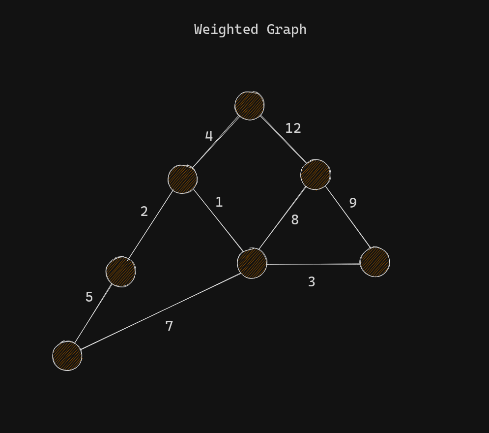
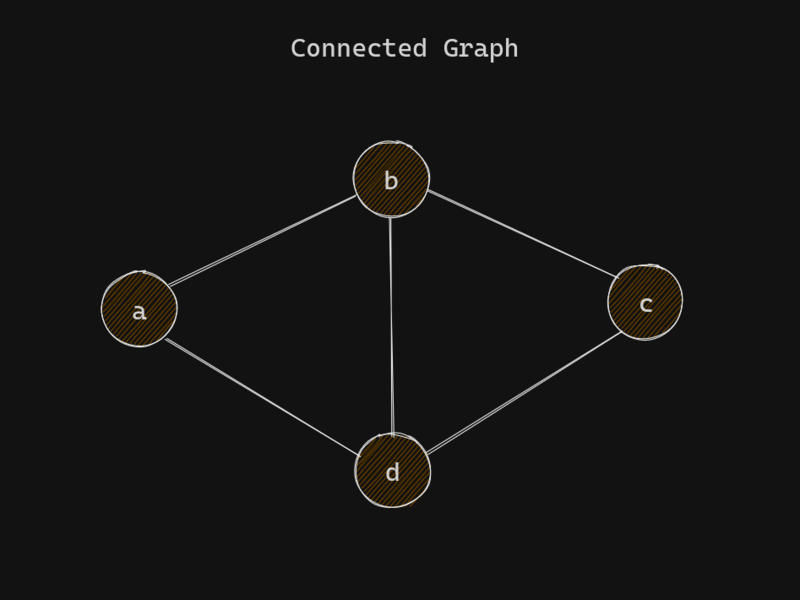
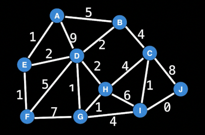

# Graphs

[WilliamFiset](https://youtube.com/playlist?list=PLDV1Zeh2NRsDGO4--qE8yH72HFL1Km93P&si=fRcGAwgmU00azmoO)

# Terminology

### Vertex (Node) , Edge (Link/Connection)

**Node** : A vertex is simply a data point in a graph, it can have edges/links to other nodes (directed / undirected). Or. A Node is A point or vertex on the graph.

**Edge** : A connection bw two vertices/nodes in a graph. It may be directed or undirected. Or. An Edge is the connection between nodes.

### Undirected Graph

An Undirected Graph is a graph in which edges have no orientation . The edge (u, v) is identical to the edge (v, u).

In the graph above the nodes can represent a cities and an edge could represent a bidirectional road.

### Directed Graph

A directed graph or `digraph` is a graph in which edges have orientations. For example edge (u, v) is the edge from node u to node v.

In the graph above, the nodes could represent people and an edge (u, v) could represent that person u bought person v a gift.

`A` bought himself a gift and for `B`.
`C` bought `A` a gift.
`D` bought `C` a gift.
`B` bought `E` and `D` a gift. and so on....

### Cycle

In graph theory, a path that starts from a given vertex and ends at the same vertex is called a cycle. Example start at Node(x) and follow the path from Node(x) and if you end up at the same node i.e Node(x), then the graph has a `cycle` or it is a `cyclic` graph.Or, a path that starts and ends at the the same node.

- In the graph above, the path "can" start at `A` and "end" at `A` forming a cycle.

### Weight

A weighted graph is a graph where each edge has a numerical value called a weight. In a graph edges have a certain amount of weight indicating that if we travel from node a to node b the edge that connects a and b which has a weight of say `10` it means it will cost 10, `10` can be anything like it consumes 10 liters of fuel or 10 dollars etc.... Or to reach from point A to B it will take 10 minutes where `10` is the weight. We just refere to it as time.

- The edges have a weight associated with them. Think maps.

### Weighted Graphs

Many graphs can have edges that contain a certain weight to represent an arbitrary value such as cost, distance, quantity, etc..

- Weighted graphs can be Directed and Undirected.
- We can denote an edge of such graph as triplet (u, v, w) and specify whether hte graph is directed or undirected.
- u, v, w represent where it is comming from and where is it going to and it's weight.

### Connected Graph

When every node has path to other node.

### Disconnected Graph

An undirected graph that is not connected is called a disconnected graph.

### Directed Acyclic Graphs (DAG)

DAGs are **directed graphs with no cycles**. These graphs play an important role in representing structures with dependencies. Several efficient algorithms exist to operate on DAGs.

## Special Graphs

### Trees

A **tree** is an undirected graph with no cycle,or it is a connected `acyclic` graph. Equivalently, it is a connected graph with **N** nodes and **N - 1** edges.

### Rooted Tree

A **rooted tree** is a tree with a **designated root node** where every edge either points away from or towards root node. When edges point away from the root the graph is called an **arborescence (out-tree)** and **anti-arborescence (in-tree)** otherwise.

**Cool fact :** All **out-trees** are DAGs but not all DAGs are not **out-trees**

### Bipartite Graph

A **bipartite graph** is a graph where the vertices can be divided into two disjoint sets such that all edges connect a vertex in one set to a vertex in another set. There are no edges between vertices in the disjoint sets

**TODO** : Understand what the above crappy definition means.

### Complete Graph

A **complete graph** is on where there is a unique edge between every pair of nodes. A complete graph with n vertices is denoted as the graph Kn (n being no.of nodes).

# Representing Graphs

### Adjacency Matrix

A **adjacency matrix** m is a very simple way to represent a graph. The idea is that the cell **m[i][j]** represents the edge weight of going from node i to j.(here i represent row and j is represent column)

If it's not a weighted graph then **m[i][j]** represent if there is a connection from i to j.

**NOTE** It is often assumed that the edge of going from a node to itself has a cost of zero. That's why the diagonal of the matrix has all zero values.

#### Pros

1. space efficient for representing dense graphs with a lot of connections.
2. Edge weight lookup is O(1).
3. Simplest graph representation.

#### Cons

1. Requires O(V^2) space.
2. Iterating over all the edges takes O(V^2).
3. It is not great for sparse graph since most cells will be empty.

### Adjacency List

An **adjacency list** is a way to represent a graph as a map from nodes to lists of edges.

#### Pros

1. Space efficient for representing sparse graphs.
2. Iterating over all edges is efficient.

#### Cons

1. Less space efficient for denser graphs.
2. Edge weight lookup is O(E).
3. Slightly more complex graph representation.

### Edge List

An **edge list** is a way to represent a graph simply as an unordered list of edges. Assume the notation for any triplet (u, v, w) meaning : "The cost from node u to node v is w".

This representation is seldomly used because of it's lack of structure. However, it is conceptually simple and practical in a handful of algorithms.

#### Pros

1. Space efficient for representing sparse graphs.
2. Iterating over all edges is efficient.
3. Very simple structure.

#### Cons

1. Less space efficient for denser graphs.
2. Edge weight lookup is O(E).

# Common Graph Theory Problems

### For the upcomming problems ask yourself : 

1. Is the graph directed or undirected ?
2. Are the edges of the graph weighted?
3. Is the graph I will encounter likely to be sparse or dense with edges?
4. Should I use an adjacency matrix, adjacency list, and edge list or other structure to represent the graph efficiently ?

### Shortest path problem

Given a weighted graph, find the shortest path of edges from node A to node B.

The algorithm should return the shortest path from start to end, let's say the algorithm returned this...

Algorithms : BFS (unweighted graph), Dijkstra's, Bellman-Ford, Floyd-Warshall, A* and many more.

### Connectivity

Does there exist a path between node A and node B?

Typical Solution : Use Union Find data structure or any search algorithm (e.g DFS).

### Negetive Cycles

Does my weighted **digraph** have any negative cycles? If so, where?

In this graph nodes 1, 2 and 3 form a negetive cycle. If you cycle thought the nodes you will end up with a total cost of `-1`, infact you can cycle endlessly getting smaller and smaller costs. It's like a trap you can never escape.

Can be benefitial, suppose we are trading currencies across an exchange or multiple exchanges, currency prices tend to remain consistant across exchanges like exchanging USD to EUROS or other currencies. TODO : Learn about this example and Negetive cycles in depth later...

Algorithms : Bellman-Ford and Floyd-Warshall.

### Strongly Connected Components

**Strongly Connected Components (SCCs)** can be thought of as **self-contained cycles** with a **directed graph** where every vertex in a given cycle can reach every other vertex in the same cycle.

Algorithms : Tarjan's and Kosaraju's algorithm.

### **Travelling Salesman Problem (TSP)** 

"Given a list of cities and the distances between each pair of cities, what is the shortest possible route that visits each city exactly once and returns to the origin city?" - Wiki

For example, the graph on the right is a possible **TSP** of the graph on the left. 

The **TSP** problem is **NP-Hard** meaning it's a very computationally challenging problem. This is unfortunate because the **TSP** has several very important applications.

Algorithms : Held-Karp (Using Dynamic Programming), branch and bound approach and many approximation algorithms (such as **Ant Colony** optimization).

### Bridges

Finding Bridges in a Graph....

A **bridge / cut edge** is any edge in a graph whose removal increases the number of connected components.

The edges hilighted in pink are bridges.

Bridges are important in graph theory because they often hint at weak points, bottlenecks or vulnerabilities in a graph. Think of bridges like a bride between islands, if you destroy the bridege you cannot reach the other island and vise-versa.

### Articulation points

Related to bridges but not the same..

An **articulation point / cut vertex** is any node in a graph whose removal increases the number of connected components.

Articulation points are hilighted in pink.

Articulation points are important in graph theory because they often hint at weak points, bottlenecks or vulnerabilities in a graph.

### Minimum Spanning Tree (MST)

A **minimum spanning tree (MST)** is a subset of the edges of a connected, edge-weighted graph that connects all the vertices together, without any cycles and with the minimum possible total edge weight. - Wiki

In summary it's a tree, meaning it has no cycles and it spans the graph at a minimum cost (hence the name MST).

One of the possible **MST's** for the graph above is....

This **MST** has a total weight of 14. And least cost is 12.

**Note** All **MST's** of a graph have **same minimal cost** but are not necessarily identical. All MST's on a graph are not always unique.

**MST's** are seen in many applications including : Designing a least cost network, circuit desigh, transportation networks, etc....

Algorithms : Kruskal's, Prim's & Borůvka's algorithm.

### **Network Flow : Max Flow**

Q: With an infinite input source how much "flow" can we push through the network?

Flow networks are networks where edge weights represent capacities in some sence... capacities might be the things like the maximum no of cars that can fit on a road or maximum amount of volume that can flow through a pipe or even the no.of boats the river can sustain without distroying the environment.

Suppose the edges are roads with cars, pipes with water or hallways packed with people. Flow represents the volume of water allowed to flow through the pipes, the no.of cars the roads can sustain in a traffic and the maximum amount of people that can navigate through the hallways.

With these maximum flow problems we can identify the bottlenecks that slow down the whole network and fix the edges that have lower capacities.

Algorithms : Ford-Fulkerson, Kdmonds-Karp & Dinic's algorithm.
