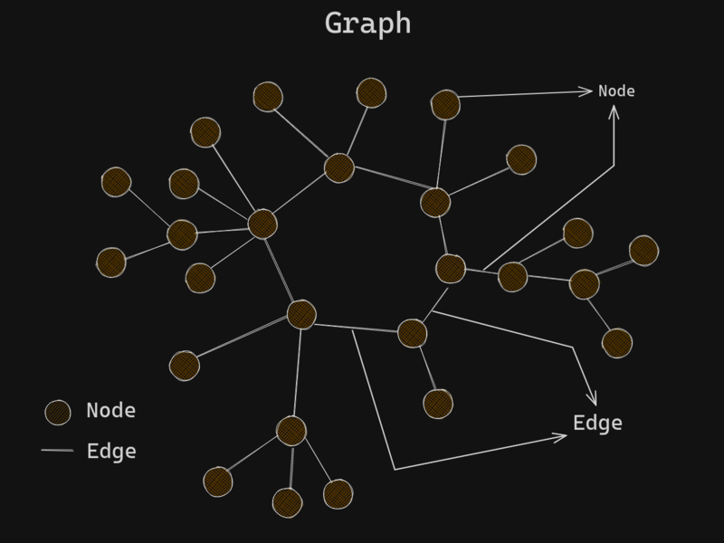

# Graphs

[WilliamFiset](https://youtube.com/playlist?list=PLDV1Zeh2NRsDGO4--qE8yH72HFL1Km93P&si=fRcGAwgmU00azmoO)

# Terminology

### Vertex (Node) , Edge (Link/Connection)

**Node** : A vertex is simply a data point in a graph, it can have edges/links to other nodes (directed / undirected). Or. A Node is A point or vertex on the graph.

**Edge** : A connection bw two vertices/nodes in a graph. It may be directed or undirected. Or. An Edge is the connection between nodes.

### Undirected Graph

An Undirected Graph is a graph in which edges have no orientation . The edge (u, v) is identical to the edge (v, u).

In the graph above the nodes can represent a cities and an edge could represent a bidirectional road.

### Directed Graph

A directed graph or `digraph` is a graph in which edges have orientations. For example edge (u, v) is the edge from node u to node v.

In the graph above, the nodes could represent people and an edge (u, v) could represent that person u bought person v a gift.

`A` bought himself a gift and for `B`.
`C` bought `A` a gift.
`D` bought `C` a gift.
`B` bought `E` and `D` a gift. and so on....

### Cycle

In graph theory, a path that starts from a given vertex and ends at the same vertex is called a cycle. Example start at Node(x) and follow the path from Node(x) and if you end up at the same node i.e Node(x), then the graph has a `cycle` or it is a `cyclic` graph.Or, a path that starts and ends at the the same node.

- In the graph above, the path "can" start at `A` and "end" at `A` forming a cycle.

### Weight

A weighted graph is a graph where each edge has a numerical value called a weight. In a graph edges have a certain amount of weight indicating that if we travel from node a to node b the edge that connects a and b which has a weight of say `10` it means it will cost 10, `10` can be anything like it consumes 10 liters of fuel or 10 dollars etc.... Or to reach from point A to B it will take 10 minutes where `10` is the weight. We just refere to it as time.

- The edges have a weight associated with them. Think maps.

### Weighted Graphs

Many graphs can have edges that contain a certain weight to represent an arbitrary value such as cost, distance, quantity, etc..

- Weighted graphs can be Directed and Undirected.
- We can denote an edge of such graph as triplet (u, v, w) and specify whether hte graph is directed or undirected.
- u, v, w represent where it is comming from and where is it going to and it's weight.

### Connected Graph

When every node has path to other node.

### Disconnected Graph

An undirected graph that is not connected is called a disconnected graph.

### Directed Acyclic Graphs (DAG)

DAGs are **directed graphs with no cycles**. These graphs play an important role in representing structures with dependencies. Several efficient algorithms exist to operate on DAGs.

## Special Graphs

### Trees

A **tree** is an undirected graph with no cycle,or it is a connected `acyclic` graph. Equivalently, it is a connected graph with **N** nodes and **N - 1** edges.

### Rooted Tree

A **rooted tree** is a tree with a **designated root node** where every edge either points away from or towards root node. When edges point away from the root the graph is called an **arborescence (out-tree)** and **anti-arborescence (in-tree)** otherwise.

**Cool fact :** All **out-trees** are DAGs but not all DAGs are not **out-trees**

### Bipartite Graph

A **bipartite graph** is a graph where the vertices can be divided into two disjoint sets such that all edges connect a vertex in one set to a vertex in another set. There are no edges between vertices in the disjoint sets

**TODO** : Understand what the above crappy definition means.

### Complete Graph

A **complete graph** is on where there is a unique edge between every pair of nodes. A complete graph with n vertices is denoted as the graph Kn (n being no.of nodes).

# Representing Graphs

### Adjacency Matrix

A **adjacency matrix** m is a very simple way to represent a graph. The idea is that the cell **m[i][j]** represents the edge weight of going from node i to j.(here i represent row and j is represent column)

If it's not a weighted graph then **m[i][j]** represent if there is a connection from i to j.

**NOTE** It is often assumed that the edge of going from a node to itself has a cost of zero. That's why the diagonal of the matrix has all zero values.

#### Pros

1. space efficient for representing dense graphs with a lot of connections.
2. Edge weight lookup is O(1).
3. Simplest graph representation.

#### Cons

1. Requires O(V^2) space.
2. Iterating over all the edges takes O(V^2).
3. It is not great for sparse graph since most cells will be empty.

### Adjacency List

An **adjacency list** is a way to represent a graph as a map from nodes to lists of edges.

#### Pros

1. Space efficient for representing sparse graphs.
2. Iterating over all edges is efficient.

#### Cons

1. Less space efficient for denser graphs.
2. Edge weight lookup is O(E).
3. Slightly more complex graph representation.

### Edge List

An **edge list** is a way to represent a graph simply as an unordered list of edges. Assume the notation for any triplet (u, v, w) meaning : "The cost from node u to node v is w".

This representation is seldomly used because of it's lack of structure. However, it is conceptually simple and practical in a handful of algorithms.

#### Pros

1. Space efficient for representing sparse graphs.
2. Iterating over all edges is efficient.
3. Very simple structure.

#### Cons

1. Less space efficient for denser graphs.
2. Edge weight lookup is O(E).

