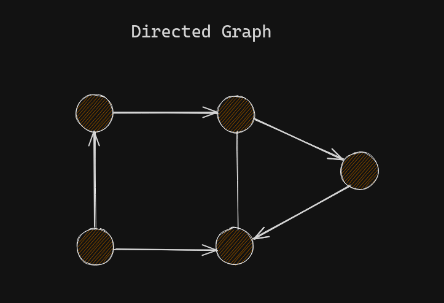

# Graphs

[WilliamFiset](https://youtube.com/playlist?list=PLDV1Zeh2NRsDGO4--qE8yH72HFL1Km93P&si=fRcGAwgmU00azmoO)

# Terms

### Vertex (Node) , Edge (Link/Connection)

`Node `: A vertex is simply a data point in a graph, it can have edges/links to other nodes (directed / undirected). Or

A Node is A point or vertex on the graph.

`Edge `: A connection bw two vertices/nodes in a graph. It may be directed or undirected. Or

An Edge is the connection between nodes.

### Weight

A weighted graph is a graph where each edge has a numerical value called a weight. In a graph edges have a certain amount of weight indicating that if we travel from node a to node b the edge that connects a and b which has a weight of say `10` it means it will cost 10, `10` can be anything like it consumes 10 liters of fuel or 10 dollars etc....

Or to reach from point A to B it will take 10 minutes where `10` is the weight. We just refere to it as time.

- The edges have a weight associated with them. Think maps.

### Cycle

In graph theory, a path that starts from a given vertex and ends at the same vertex is called a cycle. Example start at Node(x) and follow the path from Node(x) and if you end up at the same node i.e Node(x), then the graph has a `cycle` or it is a `cyclic` graph.

In the graph above, we can reach to `A` from any other nodes/vertices.

# Types of Graphs

### Connected Graph

When every node has path to other node.

### Disconnected Graph

A graph in which some vertices are not connected by any edge.

### Undirected Graph

An Undirected Graph is a graph in which edges have no orientation . The edge (u, v) is identical to the edge (v, u).

In the graph above the nodes can represent a cities and an edge could represent a bidirectional road.

### Directed Graph

A directed graph or `digraph` is a graph in which edges have orientations. For example edge (u, v) is the edge from node u to node v.

In the graph above, the nodes could represent people and an edge (u, v) could represent that person u bought person v a gift.

`A` bought himself a gift and for `B`.
`C` bought `A` a gift.
`D` bought `C` a gift.
`B` bought `E` and `D` a gift. and so on....

### Weighted Graphs

Many graphs can have edges that contain a certain weight to represent an arbitrary value such as cost, distance, quantity, etc..

- Weighted graphs can be Directed and Undirected.
- We can denote an edge of such graph as triplet (u, v, w) and specify whether hte graph is directed or undirected.
- u, v, w represent where it is comming from and where is it going to and it's weight.

