# The Heap DataStructure

[Heap](https://en.wikipedia.org/wiki/Heap_data_structure)

> The simplest way to put it is a binary tree where every child and grand child are smaller (MaxHeap), or larger (MinHeap) than the current node.

- When ever a node is added, we must adjust the tree
- When ever a node is deleted, we must adjust the tree
- There is no traversing the tree (spoiler alert : we use an array/vector)

# MinHeap

- `MinHeap :` The top value (or root) must be the smaller or equal to root. 

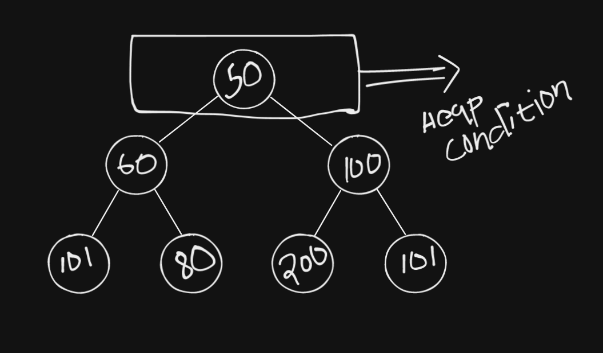

- Heaps in general maintain weak ordering.
- The above heap follows `MinHeap` condition.
- `MinHeap condition :` If it is a min heap every node below me must be larger than or equal to.
- A heap is always full or a complete tree (binary tree)
- A heap adds nodes from left to right.
- There wouldn't exit a node that has only one child, ex : a node only has right child but does not have a left child(this would not exist in a heap(min or max)).

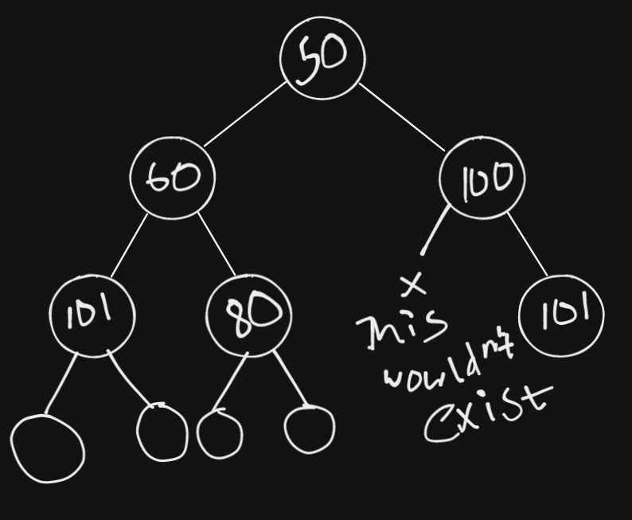

### Heap is either complete or full (Binary Tree)

- insert node with val `10`

- insert node with val `20`

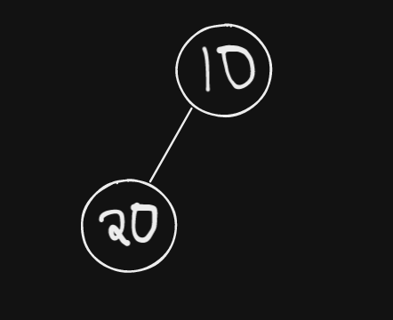

- insert node with val `30`

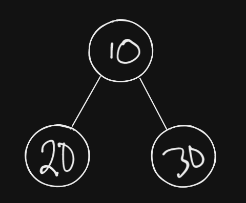

- Every node is either filled from left to right always tree level and always complete at each level.
- So that's that....

### Add a new node

Go to final spot in the tree and add the new node.

- Current

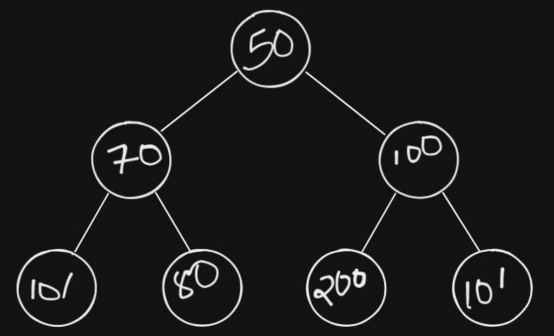

- insert/Add `3`

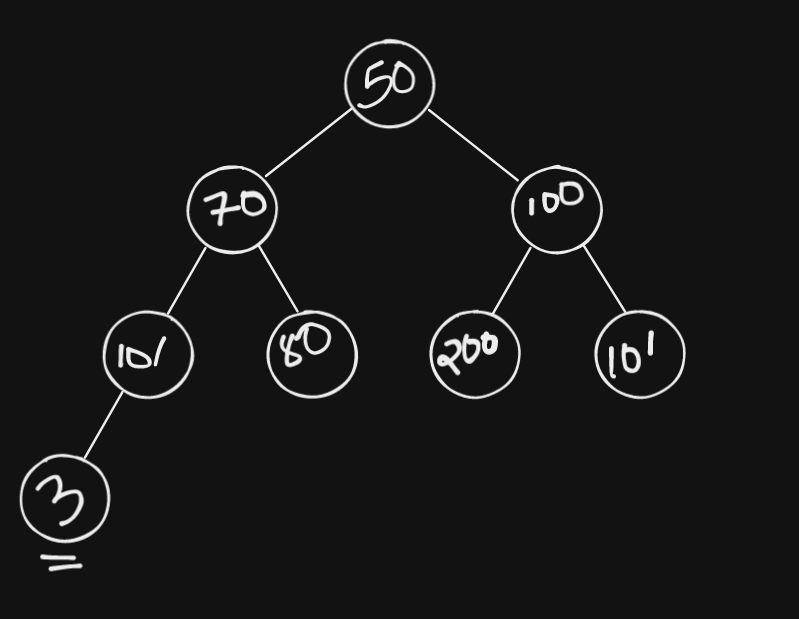

- Now `3` is not in it's correct position in the tree and is not following `MinHeap` condition....
- `HeapifyUp :` What we should do is.. we should bubble up.. i.e compare the node with it's parent if the node is smaller than parent then swap them. Do this till the new node is in it's correct position(called bubble up/HeapifyUp).

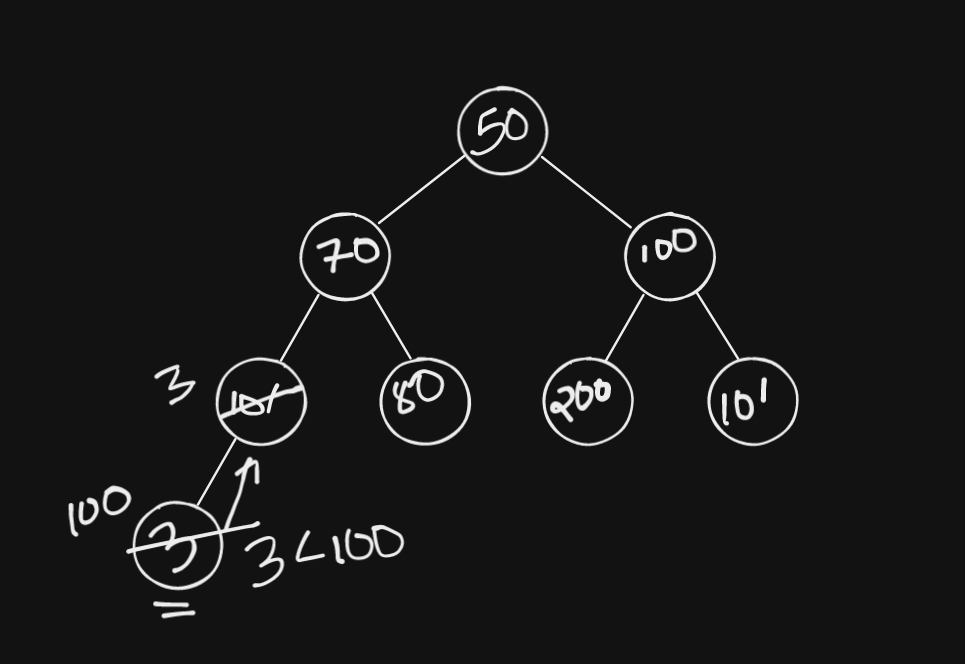

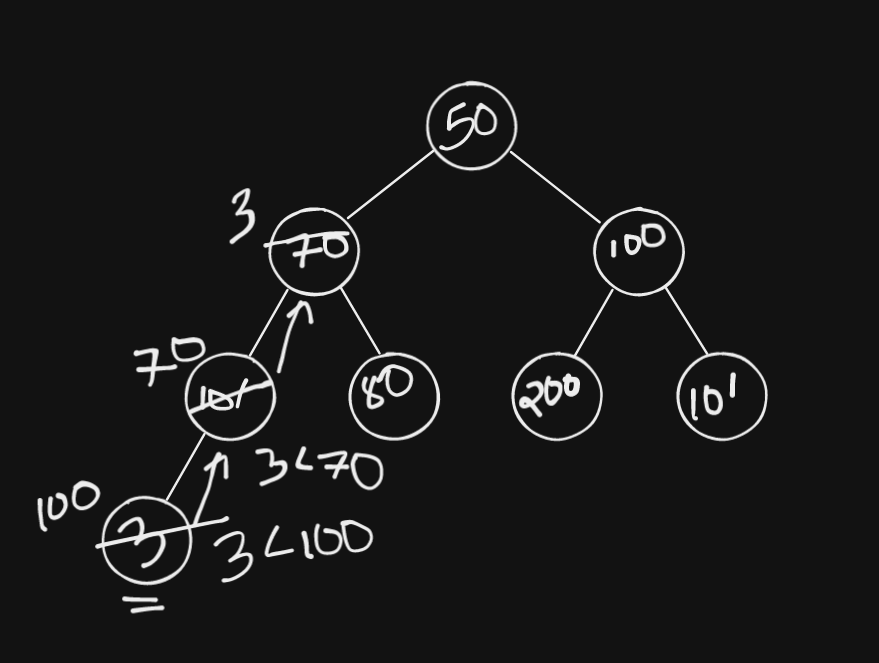

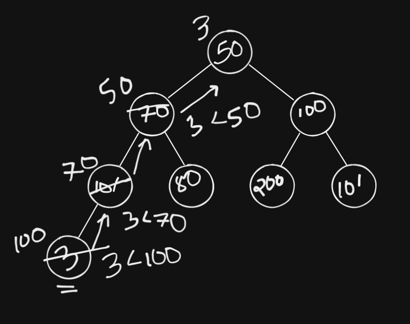

- Now `3` is in the correct position and follows `MinHeap` condition.

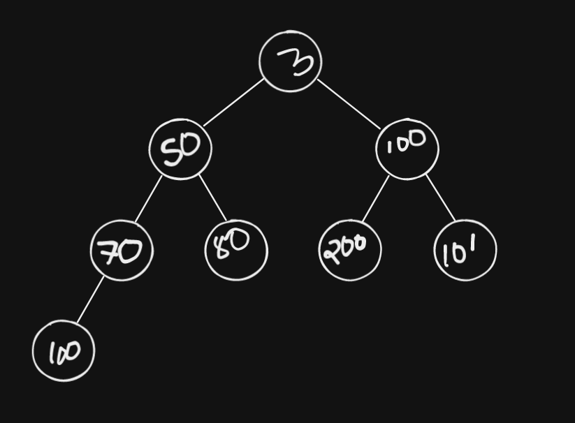

- insert/Add `200`

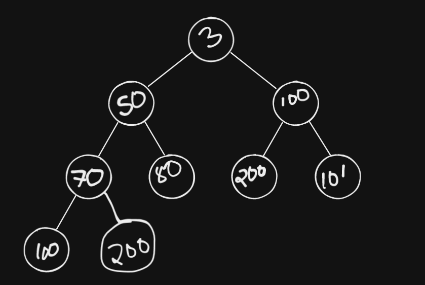

- `200` is in the correct spot(larger than parent), so we don't have to bubble up or anything.

# TODO
### Delete a node

Let's Delete `3` from the heap.
