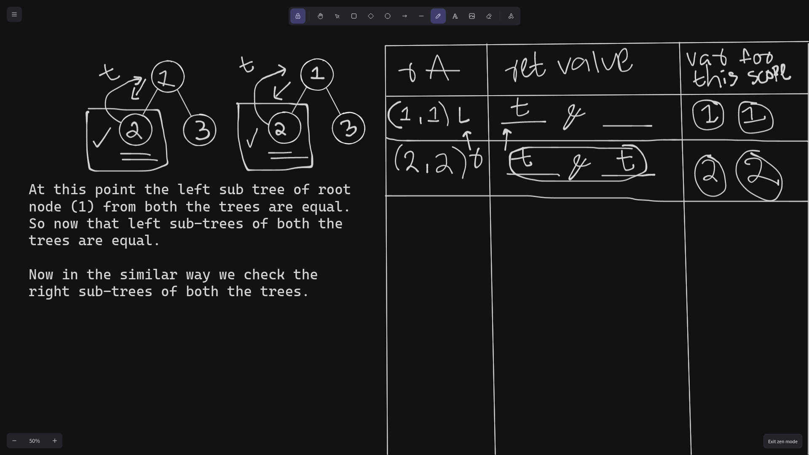

# Compare 2 Binary Trees

- Both the trees should be equal in shape/structure, i.e each each node from both the trees should have similar value and should follow similar structure.

### Example

```text
    1 
   / \
  2   3
 / \ / \
4  5 6  7

    1 
   / \
  2   3
 / \ / \
4  5 6  7

```

- the above trees have similar structure and the value of each node from 2 trees is equal.

```text
        1 
       / \
      2   3
     / \ / \
    4  5 6  7
   /
  5

    1 
   / \
  2   3
 / \ / \
4  5 6  7

```

- these are not equal both structurally and do not have similar values.

### Implementation

- use `DFS` because it preserves shape. where as `BFS` which uses `queue` will not preserve `shape`.

- Example

```text
      1 
     / \
    2   3
   /
  4

      1 
     / \
    2   3
         \
          4
```

- the order of these values are similar i.e `1 2 3 4` and `1 2 3 4` if we use `BFS` which uses queue to maintain an order.
- but we need both the trees to be structurally similar too.
- if we use `DFS` the order of the values change and when comparing both the trees order is maintained. (use an example and dryrun with both DFS an BFS).

```c++

bool compare(tree* root1, tree* root2)
{
    if (root1 == NULL && root2 == NULL) {
        // leaf node
        return true;
    }

    if (root1 == NULL || root2 == NULL) {
        // if any of the above conditions are true then return false
        return false;
    }

    if (root1->val != root2->val) {
        // if we use root1->val == root2->val
        return false;
    }

    return compare(root1->left, root2->left) && compare(root1->right, root2->right);
}

```


### This is how it works





### root1.val == root2.val (x)

- if we use this....
- when we pass root1 and root2 for the first time before even recursing the `compare()` function will return `true` to the `main()` function.
- that's why, we should only return `false` if the values are not similar
- at any point both the trees might have similar structure but have different values, in this case we should return `false` coz the are not similar in terms of node values. 

### return compare(root1->left, root2->left) && compare(root1->right, root2->right)

- (GPT) This recursive step ensures that we traverse both trees in a depth-first manner, comparing corresponding nodes on each level.

- this will compare both left subtree and right subtree of a node, and returns true of both the left and right subtree have similar structure and hold similar values.

- The best way to understand this is to just draw....

- And there is one more thing... and i.e ... this condition.

### These debug statements will help understand what is going on at every iteration.

```c++

bool compare(tree* root1, tree* root2)
{
    if (root1 == NULL && root2 == NULL) {
        // leaf node
        return true;
    }

    if (root1 == NULL || root2 == NULL) {
        // if any of the above conditions are true then return false
        return false;
    }

    if (root1->val != root2->val) {
        // if we use root1->val == root2->val
        return false;
    }

    std::cout << "root1 : " << root1->val << " , root2 : " << root2->val << " ; going left"<< endl;
    bool left_subtree = compare(root1->left, root2->left);
    std::cout << "root1 : " << root1->val << " , root2 : " << root2->val << " ; going right"<< endl;
    bool right_subtree = compare(root1->right, root2->right);
    if (left_subtree && right_subtree) {
        std::cout << "root1 : " << root1->val << " , root2 : " << root2->val << " ; done traversing left & right subtree and ret true; backtrack"<< endl;
        std::cout << endl;
    } else {
        std::cout << "root1 : " << root1->val << " , root2 : " << root2->val << " ; done traversing left & right subtree and ret false; backtrack"<< endl;
        std::cout << endl;
    }
    return left_subtree && right_subtree;
}
```

- Input

```text

        1
       / \
      2   3
     / \ / \
    4  5 6  7


        1
       / \
      2   3
     / \ / \
    4  5 6  7

```

- Output

```console

root1 : 1 , root2 : 1 ; going left
root1 : 2 , root2 : 2 ; going left
root1 : 4 , root2 : 4 ; going left
root1 : 4 , root2 : 4 ; going right
root1 : 4 , root2 : 4 ; done traversing left & right subtree and ret true; backtrack

root1 : 2 , root2 : 2 ; going right
root1 : 5 , root2 : 5 ; going left
root1 : 5 , root2 : 5 ; going right
root1 : 5 , root2 : 5 ; done traversing left & right subtree and ret true; backtrack

root1 : 2 , root2 : 2 ; done traversing left & right subtree and ret true; backtrack

root1 : 1 , root2 : 1 ; going right
root1 : 3 , root2 : 3 ; going left
root1 : 6 , root2 : 6 ; going left
root1 : 6 , root2 : 6 ; going right
root1 : 6 , root2 : 6 ; done traversing left & right subtree and ret true; backtrack

root1 : 3 , root2 : 3 ; going right
root1 : 7 , root2 : 7 ; going left
root1 : 7 , root2 : 7 ; going right
root1 : 7 , root2 : 7 ; done traversing left & right subtree and ret true; backtrack

root1 : 3 , root2 : 3 ; done traversing left & right subtree and ret true; backtrack

root1 : 1 , root2 : 1 ; done traversing left & right subtree and ret true; backtrack

Both trees are similar structurally and have similar values

```

### Let's try different input

- Input

```text

        1
       / \
      2   3
       \ / \
       5 6  7


        1
       / \
      2   3
     / \ / \
    4  5 6  7

```

- Output

```text

root1 : 1 , root2 : 1 ; going left
root1 : 2 , root2 : 2 ; going left
root1 : 2 , root2 : 2 ; going right
root1 : 5 , root2 : 5 ; going left
root1 : 5 , root2 : 5 ; going right
root1 : 5 , root2 : 5 ; done traversing left & right subtree and ret true; backtrack

root1 : 2 , root2 : 2 ; done traversing left & right subtree and ret false; backtrack

root1 : 1 , root2 : 1 ; going right
root1 : 3 , root2 : 3 ; going left
root1 : 6 , root2 : 6 ; going left
root1 : 6 , root2 : 6 ; going right
root1 : 6 , root2 : 6 ; done traversing left & right subtree and ret true; backtrack

root1 : 3 , root2 : 3 ; going right
root1 : 7 , root2 : 7 ; going left
root1 : 7 , root2 : 7 ; going right
root1 : 7 , root2 : 7 ; done traversing left & right subtree and ret true; backtrack

root1 : 3 , root2 : 3 ; done traversing left & right subtree and ret true; backtrack

root1 : 1 , root2 : 1 ; done traversing left & right subtree and ret false; backtrack

trees are not similar

```

- The above debug statements really help in understanding what's going on...look at these and draw a tree and just try to understand it ur self (future me).


### Key point in my opinion

- When we are traversing and we reached a leaf node and it's at max depth (i.e we reached the end of left subtree), let's take the above example. Say we reached node with the value `4` but in the above example the right leaf node of the `root2` has a value `4` and `root1`'s leaf node does not exist (NULL) for the left subtree of node `2`. And the left subtree of node `2` from `root1` will return `false` and after that from node `2` we will go to the right subtree and that will return `true` and finally node `2` will have this statement i.e `false && true` which will evaluate to `false` and the node `2` will return `false` entirely to node `1` i.e at level `1` at this point of time the left subtree will have evaluated `false`.. At this point of time it does not matter whether the right subtree return false or true because at the end it will be `false`.

- I know I know the above explanation might be off (idk), if so try and understand it your self by drawing an example. Or just look at the images above, you will understand (future me).

