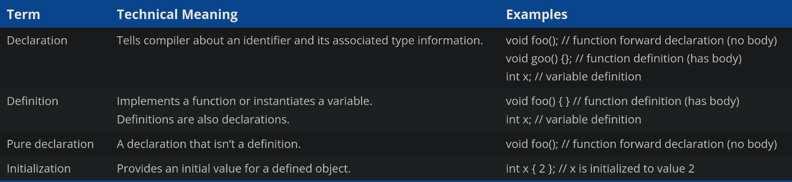

[2.7 — Forward declarations and definitions](https://www.learncpp.com/cpp-tutorial/forward-declarations/)

This might look correct but this will throw an error.

```c++
#include <iostream>

int main()
{
    std::cout << "The sum of 3 and 4 is: " << add(3, 4) << '\n';
    return 0;
}

int add(int x, int y)
{
    return x + y;
}
```

error

```console
./2_6.cpp: In function ‘int main()’:
./2_6.cpp:5:47: error: ‘add’ was not declared in this scope
    5 |     std::cout << "The sum of 3 and 4 is: " << add(3, 4) << '\n';
      |                                               ^~~
```

or it could also throw similar error, such as

```console
blah blah : 'add': identifier not found
```

When compiling this program the compiler will start from the top and once it reaches main function and then cout after, it will notice that there is a function call for `add()` but there was no such function when i was compiling from the top, so the compiler will just complain that i didn't notice this function so i did not complile it, therefore it will throw an error and stop compilation process.

#### One way to solve this issue

Reorder the function definition

```c++
#include <iostream>

int add(int x, int y)
{
    return x + y;
}

int main()
{
    std::cout << "The sum of 3 and 4 is: " << add(3, 4) << '\n';
    return 0;
}
```

This way, by the time **main** calls **add**, the compiler will already know about what **add** is. Because this is such a simple program, this change is relatively easy to do. However, in a larger program, it can be tedious trying to figure out which functions call which other functions (and in what order) so they can be declared sequentially.


This options is now always possible. An example for this would be. Let's say we're writing a program that has two functions, function **A** and **B**. If function **A** calls function **B**, and function **B** calls function **A**, there's no way to order the function in a way that will make the compiler happy. If you define function **A** first it will complain it doesn't know what function **B** is. If you define **B** first it will complain that it doesn't know function **A**.


#### another way to solve this issue is by using Forward declaration

A **forward declaration** allows us to tell the compiler about the existence of an identifier even before we deifine the identifier.

In case of a function, it allows us to tell the compiler about the existence of a function, even before we define the function's body. This way it knows that we are making a function call, and can check to ensure that we are calling a function properly, even though it doesn't **yet** know how or where the function body is defined.

To write a forward declaration for a function, we use a function declaration statement (also called as function prototype). The function declaration statement contains. The function declaration should have return type, identifier / name of the function, and parameter types, terminated by a semicolon. parameters names are optional. The function body is not included in the declaration.

```c++
type identifier(int, int, float, double); // parameters names are optional
int add(int x, int y);
```

Now the code that threw an error, will not complain when we use a forward-declaration.

```c++
#include <iostream>

int add(int x, int y); // forward declaration of add() (using a function declaration)

int main()
{
    std::cout << "The sum of 3 and 4 is: " << add(3, 4) << '\n'; // this works because we forward declared add() above
    return 0;
}

int add(int x, int y) // even though the body of add() isn't defined until here
{
    return x + y;
}
```

Now when the compiler reaches the call to **add** in main, it will know how **add** looks like (a function that takes two integer parameters and returns an integer), and it won't complain.

It is worth noting that function declaration do not need to specify the names of the parameters (as they are not considered to be a part of function declaration), we can also forward declare the above function like this :


```c++
int add(int, int); // valid function declaration
```

**Best Practice :** Keep the parameter names in your function declarations.

#### Why forward declarations ?

Why should we use forward declaration, when we can just reorder the functions to make the program work ??

Most often, function declarations are used to tell the compiler about the existence of a function that has been defined in a different code file. Reordering isn't possible in this case, because the caller and the callee are in completely different code files !!

Forward declarations can also be used to define functions in an order-agnostic manner. This allows functions to be in whatever order, maximizes organization (eg: by clustering related functions together) or by reader understanding.

Less often there are functions that call each other. Reordering is not possible in this case either. Because there is no way to reorder them in such a way that each is before the other. Forward declaration gives us a way to such problems.

#### Forgetting the function body

q : what happens if you forward declare a function but don't define it.

ans : it depends. If a forward declaration is made but the function is never called the program compile and run fine. But if a forward declaration is made and the function call is made then it will compile okay, but it will not run fine, the linker will complain that it can't resolve the function call.

consider this program

```c++
#include <iostream>

int add(int x, int y); // forward declaration of add()

int main()
{
    std::cout << "The sum of 3 and 4 is: " << add(3, 4) << '\n';
    return 0;
}

// note: No definition for function add
```

This will throw the following error in Visual Studio ..

```console
Compiling...
add.cpp
Linking...
add.obj : error LNK2001: unresolved external symbol "int __cdecl add(int,int)" (?add@@YAHHH@Z)
add.exe : fatal error LNK1120: 1 unresolved externals
```

For me the error was different..

```console
/usr/bin/ld: /tmp/ccyh1hSW.o: in function `main':
2_6.cpp:(.text+0x26): undefined reference to `add(int, int)'
collect2: error: ld returned 1 exit status
```

#### Other types of forward declarations

Forward declarations are most common for functions. But forward declarations can also be used for different identifiers in c++, like variables and types. Variables and types have a different syntax for forward declaration.


#### Declaration vs. definitions

A **declaration** will tell the compiler about the existence of an identifier and its associated type information. example

```c++
int add(int x, int y); // tells the compiler about the existence of function add which takes two arguments x and y of int type. And has a return type of int.

int x; // tells the compiler about an integer variable named x
```

A **definition** is a declaration that actually implements (for functions and types) or instantiates (for variables) the identifier.

```c++
// because this function has a body, it is an implementation of function add()
int add(int x, int y)
{
    int z{ x + y };   // instantiates variable z

    return z;
}

int x;                // instantiates variable x
```

In c++ all declarations are definitions. Therefore `int x;` is both a declaration and a definition. There reason for that is..

##### why it's both

In C++, the statement `int x;` is both a declaration and a definition, and here's why:

- Since `int x` is doing both jobs - telling the compiler about the existence of variable `x` and it's type (declaration) and allocating memory for `x` (definition). It's considered both definition and declaration.

- If you only had a declaration without defining it, like a forward declaration, you are telling the compiler about the existence of a functions but not defining it or allocating memory for the function.

---

Conversly, not all declarations are definitions. Declarations that are not definitions are called **pure declarations**. Types of pure declaration include forward declarations for functions, variables, and types.

```markdown

**Nomenclature**

In common language, the term "declaration" is typically used to mean "a pure declaration", and "definition" is used to mean "a definition that also serves as a declaration". Thus, we'd typically call `int x;` a definition, even though it is both a definition and a declaration.

```

#### Summary table



The term "declaration" is commonly used for "pure declaration", and the term "definition" is used for both a definition and a declaration.

#### The one definition rule (ODR)

The **one definition rule** is well-known rule in c++. The ODR has three parts.

1. Within a file, a functions, variable, type, or a template can only have one definition. Definitions occuring in different scopes do not violate this rule.

2. Within a program, each function or variable in a given scope can only have one definition. This rule exists because programs can have more than one file.(discussed in future lessons)

3. Types, templates, inline functions, and inline variables are allowed to have duplicate definitions in different files, as long as each definition is identical. (will be covered in future lessons)

- violating part 1 of ODR will cause the compiler to issue a redefinition error.

- violating part 2 of ODR will cause the compiler to issue a redefinition error.

- violating part 3 of ODR will cause undefined behaviour.
 
