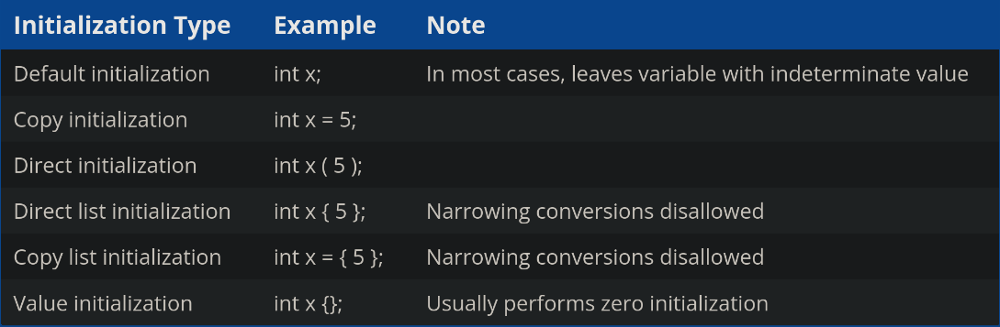

A **statement** is a type of instruction that performs some action. **Statements** are terminated by a semicolon.

A **function** is a collection of statements that execute sequentially.

A name of a variable (or a function, or object) is called it's identifier.

The rules that govern how elements in c++ language are constructed is called **syntax**. A **syntax error** occurs when you violate the rules of the language.

**Date** is any information that can be moved, processed or stored by a computer. A single piece of data is called a **value**, ex : `5` `d` or `some sentence`.

A **variable** is a named piece of memory that can be used to store a value. In order to create a variable we use a statement called **definition statement**. When the program is ran every variable is **instantiated**, which means it is assigned a memory address.

A **data type** tells the compiler how to interpret a piece of data into a meaningful value.

**copy assignment** (using operator=) assigns an already creted variable a value.

The process of specifying an initial value for a variable is called as **initialization**, and the syntax to initialize an object is called an **initializer**.

Direct initialization is sometimes called as parenthesis initialization, and list initialization (including value initialization) is called brace initialization or uniform initialization. We should prefer brace initialization over other forms of initialization, and always prefer initialization over assignment.

Although you can define multiple variables in a single statement, it's better to define and initialize each variable on it's own line, in a seperate statement.

**std::cout** and **operator<<** allows us to output result of an expression to the console.

**std::endl** outputs a new line character, which forces the console cursor to move the next line, and flushes all the contents in the buffer. The **\n** character moves the cursor to next line, but let's the system decide when to flush the buffer which is more efficient.

**std::cin** and **operator>>** allows us to get a value from the keyboard.

The variable that has not been given a value is called an **uninitialized variable**. And trying to access the value results in **undefined behaviour**.

A **literal constant** is a fixed value that has been inserted directly into the source code.

An **operation** is a process involving zero or more input values, called **operands**. We can use different **operators** to perform actions on operands. The result of an operation produces an output value.

**Unary** operator takes one operand, **Binary** takes two often called left and right. **Ternary** takes three, and **Nullary** operator takes zero operands.

An **expression** is a sequence of literals, variable, function calls that are evaluated to a single output value. And the calculation of the output value is called as **evaluation**. And the value produced is the **result** of the expression. 

A **expression statement** is an expression that is converted into a statement using a semicolon at the end of the expression.
