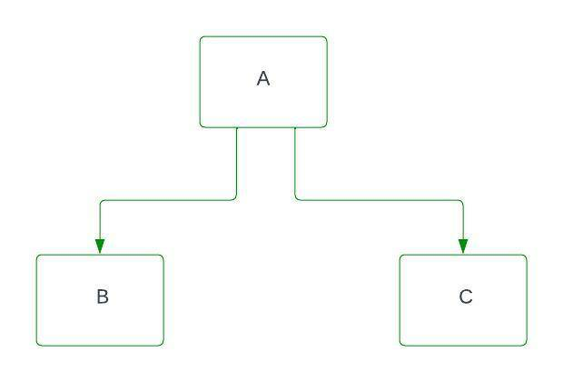

### Class & Object

`Class :` A class is like a template that defines the structure and behaviour of an object. It describes how an object should look like (it's attributes or data) and what it can do (it's members or functions).

`Object :` An Object is an instance of a class. While a class is like a general template, an object is an actual thing that is created based on that template.

- **Objects** are **entities** in real world.

- **Class** is like a blueprint of/for these entities.

### Syntax

```c++
class Name
{
    // attributes / properties
    int age;

    // methods / functions
    void print_age()
    {
        std::cout << age;
    }
};
```

### Access Modifiers

Access modifiers control the visibility (accessibility) of class members (variables and functions). There are three main access specifiers in C++.

- `private :` data / attributes  & methods / functions  accessible inside class. By default all the attributes and methods of a class are private.

- `public :` data & methods accessible for everyone.

- `protected :` data & methods accessible inside class & to it's derived class (inheritance).

When you declare a data member (like a variable or method) as private in a class, it can only be used or accessed directly inside the class’s own member functions — not from outside the class, not even by objects of that class, and not by derived (child) classes.

"Only accessible within the class" means that the variable or function can be directly accessed only by other functions that are part of the same class definition.

### getter & setter

- `setter `  A function that sets or updates the value of a private variable in a class.

- `getter ` A function that gets or returns the value of a private variable in a class.

Setter ‚Üí "Give" a value to an attribute.

Getter ‚Üí "Get" a value from an attribute.

### Encapsulation

- Encapsulation is **wrapping up** of data & member functions in a single unit called class.

- Grouping attributes and methods into a single unit and encapsulating it or putting it inside one unit(class) is called encapsulation.

- Encapsulation also helps in **data hiding** i.e making some attributes private so that user canno access them directly when creating an object. You can either have a getter or a setter to access these "hidden" attributes or just don't allow the user to access them at all.

### Constructor

Constructor is a special method that is invoked automatically at the time of object creation. And it is used for initializing the object. A constructor has these rules..

- Same name as class.
- Does not have a return type.
- Constructor is called once (automatically), at the time of object creation.
- Memory allocation happens when the constructor is called, which happens at the time of object creation.
- When there is no constructor for a class the compiler will create a constructor implicitly.
- Memory is not allocated for a class until an object is initialized.

```c++
class Name {
private:
    int x {5};
}
```
- when the compiler reaches this class it will not allocation any memory for variable x. It is just a literal in the code file.

```c++
Name obj;
```
- Now variable `x` will have a memory address, since it is initialized.
- This memory allocation happens when the constructor is called, it be a user defined or by the compiler.
- Constructor is used for initializing the object, ex.. we can assign values for private class attributes or call a method of that class, or we can do anything at the time of initializing an object using the constructor.

> default constructor does not automatically initialize built-in types — they will have garbage values unless you explicitly initialize them.

```c++
class Name {
private:
    int x; // this has a garbage value, whatever is in the memory location
}
```
> However, class-type members will be initialized properly by their own default constructors.

```c++
class Name {
private:
    std::string s; // These are properly initialized (e.g., string ‚Üí "", vector ‚Üí empty, etc.).
}
```
> Always initialize variables or attributes to avoid undefined behaviour

#### Types of constructor's

- non-parameterized , default constructor does not have any parameters.
- parameterized (has parameters, user defined)
- copy

#### Constructor overloading

- You can have multiple constructor's with different parameters. This is called as constructor overloading (kind of similar to function overloading). 

- If you have one constructor i.e non-parameterized and the other that has two parameters. And at the time of object creation if you pass any arguments then the compiler will call the constructor with parameters, or if you did not provide any arguments the it will call the one with no parameters.

- Say, you have 3 constructors one has zero parameters and one with 2 and the other with 3. At the time of object creation if you pass zero arguments the the constructor with zero parameters will be called and if you pass 2 arguments then the constructor with 2 parameters will be called and if you pass 3 arguments the constructor with 3 parameters will be called.

- Constructor overloading is a example of polymorphism. One of the example for polymorphism is constructor overloading.

### this pointer

- `this` is a special pointer in c++ that points to the current instance of the class inside a non-static member function. It allows the object to refer to itself and all it's member functions and attributes.

- `this` is implicitly used when accessing member variables or methods. `this->memberFunction()` is equivalent to `memberFunction()`. However `this` is used when member variables are shadowed by local variables with the same name.

```c++
class Example{
private:
    int x;

public:
    Example(int x)
    {
        this->x = x; // this->x is a member variable and x is a constructor parameter.
    }

}
```

- `this` pointer is only available in non-static member functions, because static functions are not tied to any particular object.

- **this->attribute** is equivalent to ***(this).attribute**. It will be dereferenced first which evaluates to an object and then `.` is used to access the object attributes.


### Shallow copy & Deep copy constructor

A **shallow** copy of an object copies all the member values from one object to another. And the default copy constructor does shallow copy.

- If there is no user defined copy constructor, then the default copy constructor will be used. It will perform a shallow copy. ex

```c++
#include <iostream>

class Student
{
private:
    std::string name;
    float cgpa;

public:
    Student(std::string&& name, float&& cgpa)
    {
        this->name = name;
        this->cgpa = cgpa;
    }

    void changeInfo(std::string&& name, float&& cgpa)
    {
        this->name = name;
        this->cgpa = cgpa;
    }

    void getInfo()
    {
        std::cout << this->name << "\n";
        std::cout << this->cgpa << "\n";
    }
};

int main (int argc, char *argv[])
{
    Student s1("henry", 7.5);
    s1.getInfo();

    Student s2(s1);
    s2.getInfo();

    s2.changeInfo("someone", 5.0);
    s2.getInfo();
    return 0;
}
```

```console
henry
7.5
henry
7.5
someone
5
```

- The default copy constructor takes a reference to an object, and copies every variables from that object to the new object.

#### User defined copy constructor (shallow)

```c++
Student(Student& orgObj)
{
    this->name = orgObj.name;
    this->cgpa = orgObj.cgpa;
}
```
- the above constructor works similar to the default copy constructor.

```console
henry
7.5
henry
7.5
someone
5
```

- shallow copy is fine in most cases but when it comes to a variable that has dynamically allocated memory instead of statically allocated memory on stack.. shallow copy does not work as intended...

### Issue with shallow copy

- The example below shows the issue with shallow copy for dynamically allocated memory for a variable.

```c++
class Student
{
private:
    std::string name;

public:
    float* cgpaPtr;
    Student(std::string&& name, float&& cgpa)
    {
        this->name = name;
        cgpaPtr = new float;
        *cgpaPtr = cgpa;
    }

    // user defined copy constructor (shallow same as default but this will be
    // used instead of default)
    Student(Student& orgObj)
    {
        this->name = orgObj.name;
        this->cgpaPtr = orgObj.cgpaPtr;
    }

    void changeInfo(std::string&& name, float&& cgpa)
    {
        this->name = name;
        *cgpaPtr = cgpa;
    }

    void getInfo()
    {
        std::cout << this->name << "\n";
        std::cout << *cgpaPtr << "\n";
    }
};


int main (int argc, char *argv[])
{
    Student s1("henry", 7.5);
    s1.getInfo();

    Student s2(s1);
    *(s2.cgpaPtr) = 5;

    s1.getInfo();

    return 0;
}
```

- This should print

```console
henry
7.5
henry
7.5
```

- but .. it does this

```console
henry
7.5
henry
5
```

- we did not mean to change the member variable of object `s1` all we did is change the values of object `s2`. But what happened is that...

- We know that when `s1` object is created, the compiler will allocate a new memory location for that object and we know that each memory location is unique for every object. so when we use shallow copy to copy variables of `s1` to `s2`, the compiler will create new memory for `s2` object and copies every variable from `s1` to `s2`. When we don't have any variable that has dynamically allocated memory, we had no problem using shallow copy. But we have a variable `float* cgpaPtr` in Student class and it uses heap memory (using `new`). 

- when we initialize `s1` using `Student s1("henry", 7.5)`, which invokes this..

```c++
Student(std::string&& name, float&& cgpa)
{
    this->name = name;
    cgpaPtr = new float;
    *cgpaPtr = cgpa;
}
```

- for `s1` object the compiler will allocate memory in the stack and `name` variable will also be in stack, but for `cgpaPtr` we will use a new memory location in heap  store `cgpa` value that is passed in the `class constructor` and let's say that `cgpaPtr` is at `200` memory location, and it's value is `7.5`.

- now when we use shallow copy here..

```c++
Student s2(s1);
```
- using the copy constructor

```c++
Student(Student& orgObj)
{
    this->name = orgObj.name;
    this->cgpaPtr = orgObj.cgpaPtr;
}
```

- every variable will be copied to s2 from s1 as is.. i.e previously `cgpaPtr` has a memory location and it's `200`, now in the above constructor when we use `Student s3(s1)` in this case it is `orgObj` what this `this->cgpaPtr = orgObj.cgpaPtr;` does is that it copies the memory location of `cgpaPtr` which was `200` to `s2`..

- so when we used this...

```c++
Student s2(s1);
*(s2.cgpaPtr) = 5;

s1.getInfo();
```

- it copied the memory location of `cgpaPtr` which was `200` and modified that using `*(s2.cgpaPtr) = 5`.. i.e why the `cgpa` is `5` instead of `7.5`. This is the problem with shallow copy for dynamically allocate member variables.

- to solve this we use deep copy for dynamically allocated member variables.

### Deep copy

- Deep copy constructor not only copies the member values but also makes copies of dynamically allocated memory that the member point to.

- To solve the issue when shallow copy for dynamic memory, the solution is simple. Allocate memory for  `cgpaPtr` inside the copy constructor so that it will not copy the memory location of the object that it is copying from.

```c++
Student(Student& orgObj)
{
    this->name = orgObj.name;
    cgpaPtr = new float;
    *cgpaPtr = *orgObj.cgpaPtr;
}
```
- This allocates new memory location for `cgpaPtr` and then copies the value of `cgpaPtr` from `orgObj` using `*cgpaPtr = *orgObj.cgpaPtr;`

- Now.. let's run this again..

```c++
int main (int argc, char *argv[])
{
    Student s1("henry", 7.5);
    s1.getInfo();

    Student s2(s1);
    *(s2.cgpaPtr) = 5;

    s1.getInfo();

    return 0;
}
```

```console
henry
7.5
henry
7.5
```

- The above output is accurate, and it is what a copy constructor should do for variables with dynamically allocated memory.

- These will help understanding the difference between shallow and deep copy.


### Destructor

A destructor in c++ is a special member function that is automatically called when an object of the class is destroyed (either when it goes out of scope or is explicitly deleted). It is used to clear any resources held by the object on the heap (dynamic memory allocated variables etc). It does not directly free up memory occupied by the entire object itself, especially if the object is stack allocated (more on this further).

```c++
class Ex
{
    ~Ex()
    {
        // clean up
    }
};
```

- User defined destructor is useful when we use deep copy, like we did for `cgpaPtr`. Here we will clear any dynamically allocated memory.

```c++
~Student()
{
    std::cout << "delete cgpaPtr\n";
    delete cgpaPtr;
}
```

- If we allocate memory manually when creating an object, then we have to free / delete that object explicitly using `delete objName`.

```c++
Student* s3 = new Student();
delete s3;
```

- If `delete s3` is not used the compiler will not call the destructor for `s3` object nor will it clear memory for the `s3` object itself let alone the `cgpaPtr`.

#### Calling destructor explicitly

##### Case 1 using `delete s3`

- `delete s3` will ensure the destructor is called which clear heap memory for `cgpaPtr` and it also frees up memory for the entire object from heap.


##### Case 2 using `s3->~Student()`

- `s3->~Student()` will only clear memory for `cgpaPtr` but will not free up memory that is used by `s3` object itself.

##### Case 3 using `s3->~Student()` and `delete s3`

```c++
Student* s3 = new Student();
s3->~Student();
delete s3;
```
- In this case the destructor is called twice one with `s3->~Student()` and again automatically with `delete s3`. And the compiler will complain.

```console
free(): double free detected in tcache 2
```
- The error is caused when trying to delete memory contents of `cgpaPtr` i.e the first time we called `s3->~Student()` it cleared the value stored at `x` memory location and the pointer is no longer pointing to any memory location, so when the destructor is triggered again the pointer no longer points to anything so nothing can be freed.

##### Case 4

```c++

~Student()
{
    std::cout << this->name <<" : delete cgpaPtr\n";
    delete cgpaPtr;
}

int main (int argc, char *argv[])
{
    Student s1("henry", 7.5);

    Student s2(s1);
    s2.changeInfo("other", 10);
    *(s2.cgpaPtr) = 5;

    s2.~Student();
    s1.~Student();

    return 0;
}
```

```console
other : delete cgpaPtr
henry : delete cgpaPtr
other : delete cgpaPtr
free(): double free detected in tcache 2
```

- changing the print statement results in this output

```c++
~Student()
{
    delete cgpaPtr;
    std::cout << this->name <<" : delete cgpaPtr\n";
}
```

```console
other : delete cgpaPtr
henry : delete cgpaPtr
free(): double free detected in tcache 2
```
- when it tries to delete a pointer which is no longer valid it will throw an error instead of printing the debug message. For now it does not matter in which order the objects are getting destroyed implicitly.

- solution is simple just dont call the destructor explicitly(i may change my opinion), as the object is stack allocated.

```c++
int main (int argc, char *argv[])
{
    Student s1("henry", 7.5);

    Student s2(s1);
    *(s2.cgpaPtr) = 5;

    // s1.~Student();
    // s2.~Student();

    return 0; // s1 and s2 objects will be cleared from stack memory and the destructor will also be called as they go out of scope here.
}
```

- The proper way

```c++

int main (int argc, char *argv[])
{
    Student s1("henry", 7.5);

    Student s2(s1);
    s2.changeInfo("other", 10);
    *(s2.cgpaPtr) = 5;

    Student* s3 = new Student();
    delete s3;

    return 0;
}
```
- console...

```console
student : delete cgpaPtr
other : delete cgpaPtr
henry : delete cgpaPtr
```

### Inheritance

When attributes & member functions of **base** (also called **parent**) class are passed on to the **derived** (also called **child**) class.

- Inheritance is used for code reusability. When a derived class shares same functionality as base class instead of rewriting all the logic you can inherit all that from base class.

- A simple example for inheritance

```c++
#include <iostream>

class Person
{
public:
    std::string name;
    int age{};

    Person()
    {
        std::cout << "person constructor\n";
    }
};

class Student : public Person
{
public:
    int rollno{};

    void getInfo()
    {
        std::cout << this->name << "\n";
        std::cout << this->age << "\n";
        std::cout << this->rollno << "\n";
    }
};

int main (int argc, char *argv[])
{
    Student s;
    s.name = "henry";
    s.age = 21;
    s.rollno= 45;

    s.getInfo();
    return 0;
}
```

- **Student** class is inheriting from **Person** class. Both **name** and **age** are inherited, and the only unique attribute of **Student** class is **rollno**.

### syntax

```c++
class Student : public Person
{
    // student class
};
```

- `public` defines the mode of inheritance i.e inherit all the public attributes and methods to **Student** class and they should be public. i.e every public attribute and method of Person class is now under public access Modifier in Student class.


```c++
class Student : private Person
{
    // student class
};
```

- `private` means inherit all the public attributes and member functions from Student class and they should be under private access modifier in Student class. It does not mean inherit all the private attributes and member functions.

#### Modes of Inheritance


- For derived class under public mode `class Student : public Person` all the properties under `public` access modifier in `Person` class will be `public` in `Student` class. And all the properties under `protected` in `Person` class will be `protected` in `Student` class. And `private` properties are not inherited at all. Or in other words..

- For `derived` class under public mode all the properties under `public` access modifier in `base` class will be `public` in `derived` class. And all the properties under `protected` in `base` class will be `protected` in `derived` class. And `private` properties are not inherited at all.


- If you want to inherit `private` properties from a base class, then just put all the private properties under protected in the base class. Then when you use `private` mode of inheritance `class Student : private Person` all the `protected` properties in the `base` class will be `private` in `derived` class. And when you use `public` mode `class Student : public Person` then all the properties under `protected` in `base` class will be `protected` in `derived` class. When you use `protected` mode `class Student : protected Person` then all the properties under `protected` in `base` class will be `protected` in `derived` class.

```markdown
Inheritance does not allow any class to inherit private attributes and methods
of a class. A class can only inherit everything under public access modifier
and can make them private, public or protected in the base class (or child
class).
```

### Order in which constructors & destructor are called

```c++

Person()
{
    std::cout << "person constructor\n";
}

Student()
{
    std::cout << "student constructor\n";
}

main()
{
    Student s;
    s.name = "henry";
    s.age = 21;
    s.rollno= 45;

}
```

```console
person constructor
Student constructor
```

- When an object is created for a derived class(Student) which inherits from base class (Person), then the constructor of the base class is called first and then constructor for derived class is called.

```c++
~Person()
{
    std::cout << "person constructor\n";
}

~Student()
{
    std::cout << "student constructor\n";
}

main()
{
    Student s;
    s.name = "henry";
    s.age = 21;
    s.rollno= 45;
}
```

```console
person constructor
Student constructor

Student destructor
person destructor
```

- In case of a destructor first the destructor of the derived class is called and then the destructor of base class is called.

### parameterized constructor & explicitly calling the constructor for the base class

```c++
Person(std::string name, int age)
{
    this->name = name;
    this->age = age;
}

Student(std::string name, int age, int rollno) : Person(name, age)
{
    this->rollno = rollno;
}

int main()
{
    Student s("henry", 21, 69);
    s.getInfo();
}
```

- We know that the constructor of the base class is called first before derived class. When the **Student** constructor is called it needs **name** and **age** but they are in **Person** class so we have to call the constructor for the base class explicitly, if you just use `Student(std::string name, int age, int rollno)` it will simply not work it will show this error

```console
│clang: Constructor for 'Student' must explicitly initialize the base class 'Person' which does not have a default co│
│nstructor [missing_default_ctor]                                                                                    │
```
- compiler error 

```console
./inheritance.cpp: In constructor ‘Student::Student(std::string, int, int)’:
./inheritance.cpp:22:5: error: no matching function for call to ‘Person::Person()’
   22 |     {
      |     ^
./inheritance.cpp:9:5: note: candidate: ‘Person::Person(std::string, int)’
    9 |     Person(std::string name, int age)
      |     ^~~~~~
./inheritance.cpp:9:5: note:   candidate expects 2 arguments, 0 provided
./inheritance.cpp:3:7: note: candidate: ‘Person::Person(const Person&)’
    3 | class Person
      |       ^~~~~~
./inheritance.cpp:3:7: note:   candidate expects 1 argument, 0 provided
./inheritance.cpp:3:7: note: candidate: ‘Person::Person(Person&&)’
./inheritance.cpp:3:7: note:   candidate expects 1 argument, 0 provided
```

### Explanation (ChatGPT)

The syntax you’ve highlighted is part of a **constructor initializer list** in C++. It is used when a derived class needs to initialize members of its base class in addition to its own members. Let's break it down:

```cpp
Student(std::string name, int age, int rollno) : Person(name, age)
```

#### Components of the Syntax:
1. **Constructor declaration:**
   ```cpp
   Student(std::string name, int age, int rollno)
   ```
   This is the constructor of the `Student` class. It takes three parameters: `name`, `age`, and `rollno`. These parameters are used to initialize both the base class (`Person`) and the derived class (`Student`) members.

2. **Initializer list:**
```cpp
: Person(name, age)
```
   This is the **initializer list** part, which initializes the base class (`Person`) using its own constructor before the body of the `Student` constructor is executed. The syntax `Person(name, age)` calls the constructor of the `Person` class, passing `name` and `age` arguments.

#### Why use an initializer list?

1. **Base class initialization:** When you have a derived class, C++ requires that the base class constructor is called before the derived class constructor starts executing. The initializer list allows the base class (`Person` in this case) to be initialized with the arguments `name` and `age`. Without the initializer list, you would not be able to directly initialize the base class members this way.
   
2. **Efficiency:** Initializer lists allow for direct initialization of base class members and member variables, avoiding extra steps such as default construction followed by reassignment, which might occur if initialization was done inside the constructor body.

#### Step-by-step execution:
1. When you create a `Student` object with:
   ```cpp
   Student s("henry", 21, 69);
   ```
   the constructor `Student(std::string name, int age, int rollno)` is called with the arguments `"henry"`, `21`, and `69`.

2. The **initializer list** `: Person(name, age)` ensures that the base class (`Person`) constructor is invoked with `"henry"` and `21`, initializing the `name` and `age` members of the `Person` class:
   ```cpp
   Person(std::string name, int age)
   {
       this->name = name;
       this->age = age;
   }
   ```

3. After the base class (`Person`) is initialized, the derived class (`Student`) constructor body is executed:
   ```cpp
   {
       this->rollno = rollno;
   }
   ```
   This sets the `rollno` member of the `Student` class to `69`.

4. Finally, the `getInfo` function is called on the `Student` object, which prints the `name`, `age`, and `rollno` values.

#### Why not initialize inside the constructor body?
While you could initialize base class members or other members inside the constructor body, doing so with an initializer list is more efficient. It directly calls the constructor of the base class and initializes the member variables in one step rather than initializing them with default values and then reassigning them.

For example, if you did the initialization inside the constructor body, it might look like this:

```cpp
Student(std::string name, int age, int rollno)
{
    Person(name, age); // This would not work the way you expect!
    this->rollno = rollno;
}
```

The above would not work because you can't call a constructor on an existing object (like `Person` in this case) in the constructor body. You need the initializer list to ensure the base class constructor is invoked before the derived class constructor starts executing.

#### Summary:
- The `: Person(name, age)` is part of an initializer list that calls the `Person` constructor to initialize the `name` and `age` members inherited from the `Person` class.
- The initializer list ensures that base class members are initialized before the derived class constructor body is executed.
- This approach is efficient and necessary to properly initialize base class members in C++.

### ChatGPT response

- For this stupid question ; using this statement `Person(name, age);` can i inherit from `Person` class with out using initializer list.

```cpp
Student(std::string name, int age, int rollno)
{
    Person(name, age); // This would not work the way you expect!
    this->rollno = rollno;
}
```

- Q1 : what does this syntax do, and does C++ create two objects and combine them or how does it work ???.. response :
It explains the proper way first and then explains the actual doubt.

#### ‚úÖ What this syntax does:

```cpp
Student(std::string name, int age, int rollno) 
    : Person(name, age)   // üëà this is called the **initializer list**
{
    std::cout << "Student constructor called, parameterised\n";
    this->rollNo = rollno;
}
```

The **`:` followed by `Person(name, age)`** is the **member initializer list**.

* It tells the compiler:

> "When constructing a `Student`, first construct the **base class part `Person`** using the `Person(name, age)` constructor."

---

#### ‚úÖ Execution flow:

When you do:

```cpp
Student s("Shiva", 23, 101);
```

1. **Memory Allocation:**
   C++ allocates enough memory for the **entire `Student` object**, which contains:

   * A **`Person` part**.
   * A **`Student`-specific part** (like `rollNo`).

2. **Construct Base Class First:**
   Because you specified `: Person(name, age)`, the compiler:

* Constructs the **`Person` sub-object** that is embedded within `Student`.
* Calls the **`Person(name, age)` constructor** to initialize that part.

3. **Construct Derived Class Next:**
   Once the `Person` part is constructed, it runs the **`Student` constructor body**:

```cpp
std::cout << "Student constructor called, parameterised\n";
this->rollNo = rollno;
```

4. **Object Fully Constructed:**
   Now, you have a single object in memory — an object of type `Student` — but this object includes the **data members of `Person` + `Student` combined into a single contiguous memory block**.

---

### ‚úÖ Important:

> **Does C++ create two separate objects and combine them?**

üëâ **NO**, it does **NOT** create two separate objects and merge them.
Instead:

* It creates **one object of type `Student`**.
* But the **first part of that memory** corresponds to the **`Person` base class part**.
* Then, after that, the **`Student`-specific members** follow.

This is part of the **object memory layout in inheritance**.

### ‚úÖ Visualization:

| Memory layout of `Student` |
| -------------------------- |
| `Person::name`             |
| `Person::age`              |
| `Student::rollNo`          |

---

### ‚úÖ Bonus Analogy

Imagine building a **vehicle**:

* `Vehicle` has **engine**.
* `Car` inherits from `Vehicle` and adds **wheels**.

When constructing a `Car`:

1. First install the **engine** (via `Vehicle`'s constructor).
2. Then add the **wheels** (via `Car`'s constructor).

But it's still **one complete car**, not two separate units glued together.

---

### ‚úÖ Summary:

* `: Person(name, age)` ensures the **Person base part of Student is properly initialized**.
* **Only ONE object is created** in memory (the `Student` object), but it's composed of the **base part** and the **derived part**.
* The **initializer list** is the **only way to control how base class and member variables (that are objects themselves) get initialized**.

- Q2 : This Person(name, age) creates a temporary object of Person class, and is destroyed after the execution of the statement Person(name, age). It is not a syntax or a proper way to call the object's constructor (you cannot call objects constructor explicitly(yeah this is another stupid question), it's not possible (yeah .. stupid i know)). this is what i understood am i correct

‚úÖ Yes, your understanding is **correct in principle**, but let's **clarify the context** to avoid confusion.

---

### If it's inside the **constructor body**, like:

```cpp
Student(std::string name, int age, int rollno)
{
    Person(name, age); // ‚úÖ YES, creates a temporary Person object, destroyed immediately
    this->rollNo = rollno;
}
```

Then your statement is **100% correct**:

> This `Person(name, age)` creates a temporary object of `Person` class, and is destroyed after the execution of the statement `Person(name, age)`.
> ‚úÖ It is not a syntax or a proper way to initialize the base class part of an object.

---

You **cannot manually call the base class constructor** (`Person` constructor in this case) on the **`Person` part of a `Student` object** inside the `Student` constructor body.

By the time the `Student` constructor body runs, the **`Person` part of `Student` is already constructed** — using the default constructor if you didn’t specify otherwise.

> ‚úÖ So, the **only place to choose *which constructor* of the base class gets called** is in the **initializer list**:

```cpp
Student(std::string name, int age, int rollno)
    : Person(name, age)   // calls the parameterized constructor of Person
{
    this->rollNo = rollno;
}
```
This way, the **base class part of the object gets initialized directly** during construction — not after.

---

* If the **base class** has a **default constructor**, it will be called automatically if the derived class doesn’t specify an initializer list.

```cpp
Student(std::string name, int age, int rollno) {}
```

* If the **base class** has **no default non-parameterized constructor**, the **derived class must initialize it** using the **initializer list**:

```cpp
Student(std::string name, int age, int rollno)
    : Person(name, age)
{}
```

* Writing `Person(name, age);` inside the derived class constructor body:

  * ‚úÖ Creates a **temporary object**, destroyed immediately.
  * ‚ùå Does **not** initialize the base part of the current object.
  * ‚ùå Will cause a **compilation error** if the base class has no default constructor(non-parameterized).

---

### ‚úÖ Summary

| Usage                                     | What Happens                                                        |
| ----------------------------------------- | ------------------------------------------------------------------- |
| `Person(name, age);` inside body          | Temporary object, destroyed immediately.                            |
| `: Person(name, age)` in initializer list | Properly initializes the **base class part** of the current object. |

---

So your statement is spot on for the first case.
Then after that i asked for memory allocation layout

#### Memory allocation (ChatGPT)

##### ‚úÖ Question:

> **When you create a `Student` object, does C++ create two separate objects — one `Person` and one `Student` — and combine them?**

---

### ‚úÖ Answer:

**No, C++ does not create two separate objects and then merge them.**

Instead, when you create a `Student` object, here's what happens:

1. **Single memory block is allocated** large enough to hold:

   * The data members from the **`Person` base class**.
   * The data members specific to the **`Student` derived class**.

2. In that **single object memory**, the layout is typically:

```
| Person's data | Student's data |
```

3. The **`Person` constructor** is called first to initialize the **Person part** of the `Student` object.

4. Then the **`Student` constructor body** runs to initialize the **Student-specific part**.

---

### ‚úÖ Visualization of Memory

If `Person` has:

```cpp
std::string name;
int age;
```

And `Student` adds:

```cpp
int rollNo;
```

Then in memory:

```
| name | age | rollNo |
```

It's still **one continuous object**, typed as `Student`.

---

### ‚úÖ Why?

Because:

* Inheritance is a **"has-a"** relationship at the memory level — the **base class data is embedded** in the derived class.
* C++ guarantees that the base class sub-object is the **first part of the derived class object memory**.

---

### ‚úÖ Bonus

You can confirm this with `sizeof`:

```cpp
std::cout << sizeof(Person) << '\n';
std::cout << sizeof(Student) << '\n';
```

You'll find:

```
sizeof(Student) >= sizeof(Person) + sizeof(rollNo)
```

(due to possible padding and alignment).

---

### ‚úÖ Conclusion

> ✔️ **Only one object** is created — but its **first portion is the base class (`Person`)**, followed by the **derived class data (`Student`)**.

#### With parameterized and non-parameterized constructor's

```cpp
class Person {
public:
    std::string name;
    int age{};

    Person()
    {
        std::cout << "Person constructor called, non parameterized\n";
        this->name = "";
        this->age = 0;
    }

    // parameterised constructor
    Person(const std::string& name, const int& age)
    {
        std::cout << "Person constructor called, parameterized\n";
        this->name = name;
        this->age = age;
    }

    ~Person()
    {
        std::cout << "Person destructor called\n";
    }

};

class Student : public Person {
public:
    int rollNo{};

    Student()
    {
        std::cout << "Student constructor called, non parameterized\n";
        this->rollNo = 0;
    }

    // parameterised constructor
    Student(const std::string& name, const int& age, const int& rollNo)
    {
        std::cout << "Student constructor called, parameterized\n";
        this->name = name;
        this->age = age;
        this->rollNo = rollNo;
    }

    void setInfo(const std::string& name, const int& age, const int& rollNo)
    {
        this->name = name;
        this->age = age;
        this->rollNo = rollNo;
    }

    void getInfo()
    {
        std::cout << this->name << '\n';
        std::cout << this->age << '\n';
        std::cout << this->rollNo << '\n';
    }

    ~Student()
    {
        std::cout << "Student destructor called\n";
    }
};
```
case 1

```cpp
int main ()
{
    Student student;
    student.getInfo();
    return 0;
}
```
output

```console
Person constructor called, non parameterized
Student constructor called, non parameterized

0
0
Student destructor called
Person destructor called
```
case 2

```cpp
Student student("shiva", 23, 101);
student.getInfo();
```

```console
Person constructor called, non parameterised
Student constructor called, parameterised
shiva
23
101
Student destructor called
Person destructor called
```

Case 3 : calling constructor explicitly using constructor initializer list
- no need to set name and ange in Student constructor as the Person constructor is called
```cpp
Student(const std::string& name, const int& age, const int& rollNo) : Person(name, age)
{
    std::cout << "Student constructor called, parameterised\n";
    this->rollNo = rollNo;
}
```
output

```console
Person constructor called, parameterised
Student constructor called, parameterised
shiva
23
101
Student destructor called
Person destructor called
```
- No matter what type of constructor we use, the constructor of base class is called first.

### Multi-level inheritance


This occurs when a class is derived from another derived class, creating a chain of inheritance (a class inherits from a class that has already inherited from another class).

```c++
class Person
{
// base class 
private:
    // private members
public:
    // public members
protected:
    // protected members
};

class Student : public Person
{
    // derived from Person
};

class GradStudent : public Student
{
    // derived from Student (which already derived from Person)
};

```

- Example Without constructors

```c++
class Person
{
public:
    std::string name;
    int age{};
};

class Student : public Person
{
public:
    int rollNo{};
};

class GradStudent : public Student
{
public:
    double cgpa{};
};

int main()
{
    GradStudent s;
    s.name = "someone";
    s.age = 22;
    s.rollNo = 69;
    s.cgpa = 9.9;

    std::cout << s.name << "\n";
    //... other print statements
    return 0;
}
```

### Multiple inheritance

Occurs when a class inherits from more than one base class.


```c++
class Child : public BaseClass1, private BaseClass2, ... {
    // member declarations
}
```

A simple example

```c++
class Student
{
public:
    std::string name;
    int rollNo;
};

class Teacher
{
public:
    std::string subject;
    double salary;
};

class TeachingAssistant : public Student, public Teacher
{
public:
    std::string researchArea;
};
```

### Hierarchical inheritance

In hierarchical inheritance, more than one sub-class inherits from a single base class. There is one base class and multiple derived classess. And other classess will also inherit from these derived classess forming a tree like structure.



Both class B and class C(derived classess) are inheriting from class A(base class).


simply Example !!!

```c++
class Person
{
public:
    std::string name;
    int age;
};

class Student : public Person {
public:
    int rollNo;
};

class Teacher : : public Person {
public:
    std::string subject;
    double salary;
};
```

### Hybrid inheritance

Hybrid Inheritance in OOP is a combination of two or more types of inheritance (like single, multiple, multilevel, hierarchical) in a single program to form a complex inheritance structure.

To simplify, in Hybrid Inheritance, any combination of these inheritance types can occur:

- Single Inheritance

- Multiple Inheritance

- Multilevel Inheritance

- Hierarchical Inheritance

It's called hybrid because it mixes them together in one hierarchy or structure.

### Polymorphism

Polymorphism means "many forms".

In programming, polymorphism is the ability of an object to take on different forms or behave differently depending on the context in which it is used.

It allows a single interface (like a function name or operator) to behave differently based on the context, such as the data type or the object calling it.

This enables the same function, method, or operator to perform different tasks depending on the situation, promoting code reusability, flexibility, and readability.

Alternative (Simpler):

> Polymorphism means an object can behave differently based on how it's used.

#### Types of polymorphism

1. Compile-time Polymorphism (Static / Early Binding)
2. Run-time Polymorphism (Dynamic / Late Binding)

##### Compile-time Polymorphism

Occurs when the method to be invoked is decided at compile-time.

###### Forms of compile-time polymorphism

1. Function overloading
2. Operator overloading

###### 1. Function overloading

Function overloading occurs when you have two or more functions with the same name but with:

- A different number of parameters, or
- The same number of parameters but with different types.

A function is said to be overloaded when:

- There are two or more functions with the same name but a different number of parameters.
- There are functions with the same number of parameters, but the parameter types are different.

⚠️ Note:
> If two functions have the same name, the same number of parameters, and the same parameter types, but only differ in their return type, this does not qualify as function overloading.

You will get an error:
```console
Functions that differ only in their return type cannot be overloaded.
```

```cpp
class Calculator {
public:
    int add(int nbr1, int nbr2)
    {
        return nbr1 + nbr2;
    }

    double add(double nbr1, double nbr2)
    {
        return nbr1 + nbr2;
    }
};

int main ()
{
    Calculator c;
    std::cout << c.add(1, 2) << '\n';
    std::cout << c.add(2.5, 2.5) << '\n';
    return 0;
}
```

###### Operator overloading

```cpp
class Point {
public:
    int var_x{0};
    int var_y{0};

    Point(int x, int y)
    {
        this->var_x = x;
        this->var_y = y;
    }

    Point operator + (const Point& obj)
    {
        return Point(this->var_x + obj.var_x, this->var_y + obj.var_y);
    }
};

int main ()
{
    Point x(1, 2);
    Point y(2, 3);

    Point z = x + y;
    std::cout << z.var_x << '\n';
    std::cout << z.var_y << '\n';

    return 0;
}
```
when we use this `Point z = x + y`

It will call operator overloading method like this under the hood

```cpp
Point z = x.operator+(y);
```
object `x` is calling the overload method with object `y` as the argument. So inside the method. `this` refers to object `x`.

So this `x.operator+(y)` expression will return a new `Point` object `Point(3, 5)`

To simplify

```cpp
Point operator + (const Point& obj)
```

`x` is the object calling (`this` refers to x).
`y` is passed as the `obj` parameter.

A new `Point(3, 5)` is returned as the result of this expression in the method `return Point(this->var_x + obj.var_x, this->var_y + obj.var_y)`

In Summary this statement `Point z = x + y;` does this

1. `x + y` is called:
- `x` ‚Üí calling object (`this` inside `operator+`)
- `y` ‚Üí passed to `obj`

2. Inside `operator+`:
- `this->var_x` and `this->var_y` ‚Üí from `x`
- obj.x and obj.y ‚Üí from y

3. Returns:

```cpp
Point(this->var_x + obj.var_x, this->var_y + obj.var_y);
```
- That result is assigned to `z`.

###### 2. Run-Time Polymorphism

Occurs when the method to invoke is determined at runtime using virtual functions.

Achieved via
- Method Overriding
- Using base class pointers or references to invoke derived class functions (more on this later)


###### Virtual function

A virtual function in C++ is a member function in a base class that you expect to be overridden in derived classes.

It enables runtime polymorphism, allowing the function that gets called to depend on the actual type of the object, not the pointer/reference type.

Example: Run-Time Polymorphism

```cpp
class Animal {
public:
    virtual void speak()
    {
        std::cout << "Animal speaks\n";
    }
};

class Dog : public Animal {
public:
    void speak() override {
        std::cout << "Dog barks\n";
    }
};

class Cat : public Animal {
public:
    void speak() override {
        std::cout << "Cat meows\n";
    }
};

int main ()
{
    Animal* animal;
    Dog dog;
    Cat cat;

    animal = &dog;
    animal->speak(); // prints : dog barks

    animal = &cat;
    animal->speak(); // prints : cat meows
}
```
Here, the `speak` method is virtual, so the function called is based on the actual object type at runtime (`Dog` or `Cat`), not the pointer type.

Conclusion

Polymorphism helps us write flexible and reusable code. It lets us use the same function name on different objects, and each object can behave in its own way when that function is called.

To understand why virtual functions are useful let me just remove the `virtual` keyword and `override` keyword in the base and derived class, and let's see what happens. Here is the class without virtual function and override.

```cpp
class Animal {
public:
    void speak()
    {
        std::cout << "Animal speaks\n";
    }
};

class Dog : public Animal {
public:
    void speak() {
        std::cout << "Dog barks\n";
    }
};

class Cat : public Animal {
public:
    void speak() {
        std::cout << "Cat meows\n";
    }
};
```
Now let's try this once more..

```cpp
Animal* animal;
Dog dog;
Cat cat;

animal = &dog;
animal->speak(); // prints : Animal speak

animal = &cat;
animal->speak(); // prints : Animal speak

Dog dog2;
dog2.speak(); // prints : Dog barks
```

console

```console
Animal speaks
Animal speaks
Dog barks
```
When you call a function directly on the object itself, like:

```cpp
Dog dog2;
dog2.speak();
```
- The derived class function (`Dog::speak`) is called whether or not you use virtual.
- That's because the object type is known at compile-time — so the compiler chooses the correct function.

But... when using a base class pointer or reference:

```cpp
Animal* animal = &dog;
animal->speak();
```

- Without `virtual`: calls base class version ‚Üí `Animal speaks`.
- With `virtual`: calls derived class version ‚Üí `Dog barks`.

Why this happens is because..

- Without `virtual`, the function call is resolved based on the pointer/reference type (`Animal*`).
- With `virtual`, the function call is resolved based on the actual object (`Dog` or `Cat`) at runtime — this is runtime polymorphism.

Why use virtual

- We want to call derived class methods via a base class pointer or reference.
- We want the behavior to depend on the actual object type, not the pointer type.

I found the best example to demonstract the use case of `virtual` functions.

Suppose you're building an app where users can draw various shapes like : Circle, Rectangle, Triangle. You want to store all the shapes in one list, and when the user clicks "Draw All", each shape knows how to draw itself differently.

```cpp
class Shape {
public:
    virtual void draw()
    {
        std::cout << "Drawing a generic shape\n";
    }
};

class Circle : public Shape {
public:
    void draw() override {
        std::cout << "Drawing a Circle\n";
    }
};

class Rectangle : public Shape {
public:
    void draw() override {
        std::cout << "Drawing a Rectangle\n";
    }
};

class Triangle : public Shape {
public:
    void draw() override {
        std::cout << "Drawing a Triangle\n";
    }
};

int main()
{
    // fyi i would use a vector when i don't know how many shapes i will draw,
    // for now this is just a demo so just use an array

    Circle circle;
    Rectangle rectangle;
    Triangle triangle;

    std::vector<Shape*> shapes { &circle, &rectangle, &triangle };

    for (auto itr = shapes.begin(); itr != shapes.end(); ++itr)
    {
        (*itr)->draw(); // Calls the correct draw() based on actual shape
    }

    return 0;
}
```
console

```console
Drawing a Circle
Drawing a Rectangle
Drawing a Triangle
```

Why is this powerful?

- You don't need to know what type of shape it is when drawing.

- Later, when you want to draw a Hexagon or any new shape, you just need to create the object and add it to the same `shapes` vector.

- You don't need to create a separate vector for each shape type or change the drawing loop — the existing logic will automatically call the correct `draw()` function for every shape.

This is runtime polymorphism:

- A base class pointer (`Shape*`) can point to any derived shape (`Circle`, `Rectangle`, etc.).
- At runtime, the correct draw() is called for the actual object.

Real-world Uses

- UI libraries: All UI elements (buttons, sliders, text fields) might be treated as `Widget*` or `Component*` but draw themselves differently.
- Graphics engines: Common base classes for rendering, but the actual object dictates how to render.

Why Use Virtual Functions?

We use virtual functions when:

> We want to call the same function name on different objects but have each object perform its own specific behavior — even when accessed through a base class pointer or reference.

A more friendly explanation:

> Virtual functions allow me to treat different derived class objects uniformly through a base class pointer or reference, but still ensure that the correct, derived class-specific behavior is invoked at runtime.
>This is key to implementing runtime polymorphism, which makes the code flexible, extendable, and easier to maintain — since I can add new shapes or objects without changing the core logic that uses the base class.
