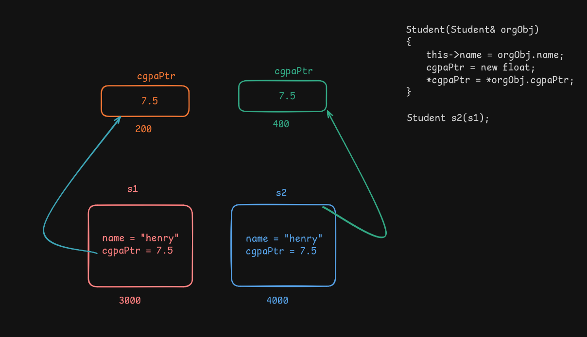
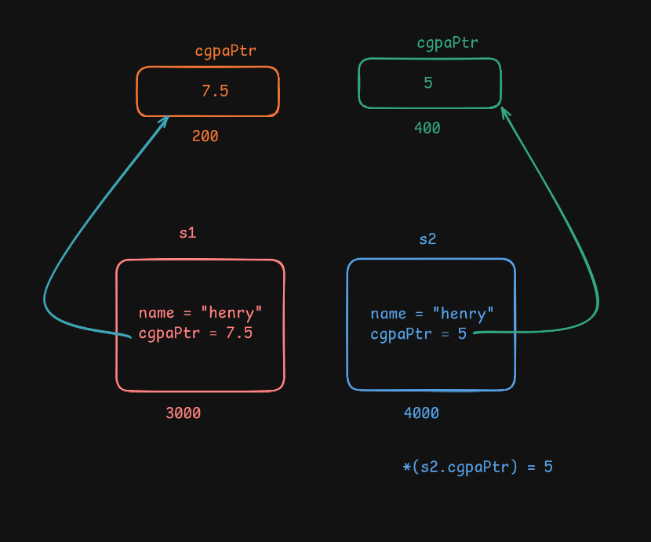

### Class & Object

`Class :` A class is like a template that defines the structure and behaviour of an object. It describes how an object should look like (it's attributes or data) and what it can do (it's members or functions).

`Object :` An Object is an instance of a class. While a class is like a general template, an object is an actual thing that is created based on that template.

- **Objects** are **entities** in real world.

- **Class** is like a blueprint of/for these entities.

### Syntax

```c++
class Name
{
    // attributes / properties
    int age;

    // methods / functions
    void print_age()
    {
        std::cout << age;
    }
};
```

### Access Modifiers

- `private :` data / attributes  & methods / functions  accessible inside class. By default all the attributes and methods of a class are private.

- `public :` data & methods accessible for everyone.

- `protected :` data & methods accessible inside class & to it's derived class (inheritance).

### getter & setter

- `setter `  set / initialize private values of a class with a value.

- `getter ` get / access private values of a class, ex : get value of a private variable, or print the value of a private variable.

### Encapsulation

- Encapsulation is **wrapping up** of data & member functions in a single unit called class.

- Grouping attributes and methods into a single unit and encapsulating it or putting it inside one unit(class) is called encapsulation.

- Encapsulation also helps in **data hiding** i.e making some attributes private so that user canno access them directly when creating an object. You can either have a getter or a setter to access these "hidden" attributes or just don't allow the user to access them at all.

### Constructor

Constructor is a special method that is invoked automatically at the time of object creation. And it is used for initializing the object. A constructor has these rules..

- Same name as class.
- Does not have a return type.
- Constructor is called once (automatically), at the time of object creation.
- Memory allocation happens when the constructor is called, which happens at the time of object creation.
- When there is no constructor for a class the compiler will create a constructor implicitly.
- Memory is not allocated for a class until an object is initialized.

```c++
class Name {
private:
    int x {5};
}
```
- when the compiler reaches this class it will not allocation any memory for variable x. It is just a literal in the code file.

```c++
Name obj;
```
- Now variable `x` will have a memory address, since it is initialized.
- This memory allocation happens when the constructor is called, it be a user defined or by the compiler.
- Constructor is used for initializing the object, ex.. we can assign values for private class attributes or call a method of that class, or we can do anything at the time of initializing an object using the constructor.

#### Types of constructor's

- non-parameterized , default constructor does not have any parameters.
- parameterized (has parameters, user defined)
- copy

#### Constructor overloading

- You can have multiple constructor's with different parameters. This is called as constructor overloading (kind of similar to function overloading). 

- If you have one constructor i.e non-parameterized and the other that has two parameters. And at the time of object creation if you pass any arguments then the compiler will call the constructor with parameters, or if you did not provide any arguments the it will call the one with no parameters.

- Say, you have 3 constructors one has zero parameters and one with 2 and the other with 3. At the time of object creation if you pass zero arguments the the constructor with zero parameters will be called and if you pass 2 arguments then the constructor with 2 parameters will be called and if you pass 3 arguments the constructor with 3 parameters will be called.

- Constructor overloading is a example of polymorphism. One of the example for polymorphism is constructor overloading.

### this pointer

- `this` is a special pointer in c++ that points to the current instance of the class inside a non-static member function. It allows the object to refer to itself and all it's member functions and attributes.

- `this` is implicitly used when accessing member variables or methods. `this->memberFunction()` is equivalent to `memberFunction()`. However `this` is used when member variables are shadowed by local variables with the same name.

```c++
class Example{
private:
    int x;

public:
    Example(int x)
    {
        this->x = x; // this->x is a member variable and x is a constructor parameter.
    }

}
```

- `this` pointer is only available in non-static member functions, because static functions are not tied to any particular object.

- **this->attribute** is equivalent to ***(this).attribute**. It will be dereferenced first which evaluates to an object and then `.` is used to access the object attributes.


### Shallow copy & Deep copy constructor

A **shallow** copy of an object copies all the member values from one object to another. And the default copy constructor does shallow copy.

- If there is no user defined copy constructor, then the default copy constructor will be used. It will perform a shallow copy. ex

```c++
#include <iostream>

class Student
{
private:
    std::string name;
    float cgpa;

public:
    Student(std::string&& name, float&& cgpa)
    {
        this->name = name;
        this->cgpa = cgpa;
    }

    void changeInfo(std::string&& name, float&& cgpa)
    {
        this->name = name;
        this->cgpa = cgpa;
    }

    void getInfo()
    {
        std::cout << this->name << "\n";
        std::cout << this->cgpa << "\n";
    }
};

int main (int argc, char *argv[])
{
    Student s1("henry", 7.5);
    s1.getInfo();

    Student s2(s1);
    s2.getInfo();

    s2.changeInfo("someone", 5.0);
    s2.getInfo();
    return 0;
}
```

```console
henry
7.5
henry
7.5
someone
5
```

- The default copy constructor takes a reference to an object, and copies every variables from that object to the new object.

#### User defined copy constructor (shallow)

```c++
Student(Student& orgObj)
{
    this->name = orgObj.name;
    this->cgpa = orgObj.cgpa;
}
```
- the above constructor works similar to the default copy constructor.

```console
henry
7.5
henry
7.5
someone
5
```

- shallow copy is fine in most cases but when it comes to a variable that has dynamically allocated memory instead of statically allocated memory on stack.. shallow copy does not work as intended...

### Issue with shallow copy

- The example below shows the issue with shallow copy for dynamically allocated memory for a variable.

```c++
class Student
{
private:
    std::string name;

public:
    float* cgpaPtr;
    Student(std::string&& name, float&& cgpa)
    {
        this->name = name;
        cgpaPtr = new float;
        *cgpaPtr = cgpa;
    }

    // user defined copy constructor (shallow same as default but this will be
    // used instead of default)
    Student(Student& orgObj)
    {
        this->name = orgObj.name;
        this->cgpaPtr = orgObj.cgpaPtr;
    }

    void changeInfo(std::string&& name, float&& cgpa)
    {
        this->name = name;
        *cgpaPtr = cgpa;
    }

    void getInfo()
    {
        std::cout << this->name << "\n";
        std::cout << *cgpaPtr << "\n";
    }
};


int main (int argc, char *argv[])
{
    Student s1("henry", 7.5);
    s1.getInfo();

    Student s2(s1);
    *(s2.cgpaPtr) = 5;

    s1.getInfo();

    return 0;
}
```

- This should print

```console
henry
7.5
henry
7.5
```

- but .. it does this

```console
henry
7.5
henry
5
```

- we did not mean to change the member variable of object `s1` all we did is change the values of object `s2`. But what happened is that...

- We know that when `s1` object is created, the compiler will allocate a new memory location for that object and we know that each memory location is unique for every object. so when we use shallow copy to copy variables of `s1` to `s2`, the compiler will create new memory for `s2` object and copies every variable from `s1` to `s2`. When we don't have any variable that has dynamically allocated memory, we had no problem using shallow copy. But we have a variable `float* cgpaPtr` in Student class and it uses heap memory (using `new`). 

- when we initialize `s1` using `Student s1("henry", 7.5)`, which invokes this..

```c++
Student(std::string&& name, float&& cgpa)
{
    this->name = name;
    cgpaPtr = new float;
    *cgpaPtr = cgpa;
}
```

- for `s1` object the compiler will allocate memory in the stack and `name` variable will also be in stack, but for `cgpaPtr` we will use a new memory location in heap  store `cgpa` value that is passed in the `class constructor` and let's say that `cgpaPtr` is at `200` memory location, and it's value is `7.5`.

- now when we use shallow copy here..

```c++
Student s2(s1);
```
- using the copy constructor

```c++
Student(Student& orgObj)
{
    this->name = orgObj.name;
    this->cgpaPtr = orgObj.cgpaPtr;
}
```

- every variable will be copied to s2 from s1 as is.. i.e previously `cgpaPtr` has a memory location and it's `200`, now in the above constructor when we use `Student s3(s1)` in this case it is `orgObj` what this `this->cgpaPtr = orgObj.cgpaPtr;` does is that it copies the memory location of `cgpaPtr` which was `200` to `s2`..

- so when we used this...

```c++
Student s2(s1);
*(s2.cgpaPtr) = 5;

s1.getInfo();
```

- it copied the memory location of `cgpaPtr` which was `200` and modified that using `*(s2.cgpaPtr) = 5`.. i.e why the `cgpa` is `5` instead of `7.5`. This is the problem with shallow copy for dynamically allocate member variables.

- to solve this we use deep copy for dynamically allocated member variables.

### Deep copy

- Deep copy constructor not only copies the member values but also makes copies of dynamically allocated memory that the member point to.

- To solve the issue when shallow copy for dynamic memory, the solution is simple. Allocate memory for  `cgpaPtr` inside the copy constructor so that it will not copy the memory location of the object that it is copying from.

```c++
Student(Student& orgObj)
{
    this->name = orgObj.name;
    cgpaPtr = new float;
    *cgpaPtr = *orgObj.cgpaPtr;
}
```
- This allocates new memory location for `cgpaPtr` and then copies the value of `cgpaPtr` from `orgObj` using `*cgpaPtr = *orgObj.cgpaPtr;`

- Now.. let's run this again..

```c++
int main (int argc, char *argv[])
{
    Student s1("henry", 7.5);
    s1.getInfo();

    Student s2(s1);
    *(s2.cgpaPtr) = 5;

    s1.getInfo();

    return 0;
}
```

```console
henry
7.5
henry
7.5
```

- The above output is accurate, and it is what a copy constructor should do for variables with dynamically allocated memory.

- These will help understanding the difference between shallow and deep copy.






### Destructor

A destructor in c++ is a special member function that is automatically called when an object of the class is destroyed (either when it goes out of scope or is explicitly deleted). It is used to clear any resources held by the object on the heap (dynamic memory allocated variables etc). It does not directly free up memory occupied by the entire object itself, especially if the object is stack allocated (more on this further).

```c++
class Ex
{
    ~Ex()
    {
        // clean up
    }
};
```

- User defined destructor is useful when we use deep copy, like we did for `cgpaPtr`. Here we will clear any dynamically allocated memory.

```c++
~Student()
{
    std::cout << "delete cgpaPtr\n";
    delete cgpaPtr;
}
```

- If we allocate memory manually when creating an object, then we have to free / delete that object explicitly using `delete objName`.

```c++
Student* s3 = new Student();
delete s3;
```

- If `delete s3` is not used the compiler will not call the destructor for `s3` object nor will it clear memory for the `s3` object itself let alone the `cgpaPtr`.

#### Calling destructor explicitly

##### Case 1 using `delete s3`

- `delete s3` will ensure the destructor is called which clear heap memory for `cgpaPtr` and it also frees up memory for the entire object from heap.


##### Case 2 using `s3->~Student()`

- `s3->~Student()` will only clear memory for `cgpaPtr` but will not free up memory that is used by `s3` object itself.

##### Case 3 using `s3->~Student()` and `delete s3`

```c++
Student* s3 = new Student();
s3->~Student();
delete s3;
```
- In this case the destructor is called twice one with `s3->~Student()` and again automatically with `delete s3`. And the compiler will complain.

```console
free(): double free detected in tcache 2
```
- The error is caused when trying to delete memory contents of `cgpaPtr` i.e the first time we called `s3->~Student()` it cleared the value stored at `x` memory location and the pointer is no longer pointing to any memory location, so when the destructor is triggered again the pointer no longer points to anything so nothing can be freed.

##### Case 4

```c++

~Student()
{
    std::cout << this->name <<" : delete cgpaPtr\n";
    delete cgpaPtr;
}

int main (int argc, char *argv[])
{
    Student s1("henry", 7.5);

    Student s2(s1);
    s2.changeInfo("other", 10);
    *(s2.cgpaPtr) = 5;

    s2.~Student();
    s1.~Student();

    return 0;
}
```

```console
other : delete cgpaPtr
henry : delete cgpaPtr
other : delete cgpaPtr
free(): double free detected in tcache 2
```

- changing the print statement results in this output

```c++
~Student()
{
    delete cgpaPtr;
    std::cout << this->name <<" : delete cgpaPtr\n";
}
```

```console
other : delete cgpaPtr
henry : delete cgpaPtr
free(): double free detected in tcache 2
```
- when it tries to delete a pointer which is no longer valid it will throw an error instead of printing the debug message. For now it does not matter in which order the objects are getting destroyed implicitly.

- solution is simple just dont call the destructor explicitly(i may change my opinion), as the object is stack allocated.

```c++
int main (int argc, char *argv[])
{
    Student s1("henry", 7.5);

    Student s2(s1);
    *(s2.cgpaPtr) = 5;

    // s1.~Student();
    // s2.~Student();

    return 0; // s1 and s2 objects will be cleared from stack memory and the destructor will also be called as they go out of scope here.
}
```

- The proper way

```c++

int main (int argc, char *argv[])
{
    Student s1("henry", 7.5);

    Student s2(s1);
    s2.changeInfo("other", 10);
    *(s2.cgpaPtr) = 5;

    Student* s3 = new Student();
    delete s3;

    return 0;
}
```
- console...

```console
student : delete cgpaPtr
other : delete cgpaPtr
henry : delete cgpaPtr
```

### Inheritance

When attributes & member functions of **base** (also called **parent**) class are passed on to the **derived** (also called **child**) class.

- Inheritance is used for code reusability. When a derived class shares same functionality as base class instead of rewriting all the logic you can inherit all that from base class.

- A simple example for inheritance

```c++
#include <iostream>

class Person
{
public:
    std::string name;
    int age{};

    Person()
    {
        std::cout << "person constructor\n";
    }
};

class Student : public Person
{
public:
    int rollno{};

    void getInfo()
    {
        std::cout << this->name << "\n";
        std::cout << this->age << "\n";
        std::cout << this->rollno << "\n";
    }
};

int main (int argc, char *argv[])
{
    Student s;
    s.name = "henry";
    s.age = 21;
    s.rollno= 45;

    s.getInfo();
    return 0;
}
```

- **Student** class is inheriting from **Person** class. Both **name** and **age** are inherited, and the only unique attribute of **Student** class is **rollno**.

### syntax

```c++
class Student : public Person
{
    // student class
};
```

- `public` defines the mode of inheritance i.e inherit all the public attributes and methods to **Student** class and they should be public. i.e every public attribute and method of Person class is now under public access Modifier in Student class.


```c++
class Student : private Person
{
    // student class
};
```

- `private` means inherit all the public attributes and member functions from Student class and they should be under private access modifier in Student class. It does not mean inherit all the private attributes and member functions.

#### Modes of Inheritance


- For derived class under public mode `class Student : public Person` all the properties under `public` access modifier in `Person` class will be `public` in `Student` class. And all the properties under `protected` in `Person` class will be `protected` in `Student` class. And `private` properties are not inherited at all. Or in other words..

- For `derived` class under public mode all the properties under `public` access modifier in `base` class will be `public` in `derived` class. And all the properties under `protected` in `base` class will be `protected` in `derived` class. And `private` properties are not inherited at all.


- If you want to inherit `private` properties from a base class, then just put all the private properties under protected in the base class. Then when you use `private` mode of inheritance `class Student : private Person` all the `protected` properties in the `base` class will be `private` in `derived` class. And when you use `public` mode `class Student : public Person` then all the properties under `protected` in `base` class will be `protected` in `derived` class. When you use `protected` mode `class Student : protected Person` then all the properties under `protected` in `base` class will be `protected` in `derived` class.

```markdown
Inheritance does not allow any class to inherit private attributes and methods
of a class. A class can only inherit everything under public access modifier
and can make them private, public or protected in the base class (or child
class).
```

### Order in which constructors & destructor are called

```c++

Person()
{
    std::cout << "person constructor\n";
}

Student()
{
    std::cout << "student constructor\n";
}

main()
{
    Student s;
    s.name = "henry";
    s.age = 21;
    s.rollno= 45;

}
```

```console
person constructor
Student constructor
```

- When an object is created for a derived class(Student) which inherits from base class (Person), then the constructor of the base class is called first and then constructor for derived class is called.

```c++
~Person()
{
    std::cout << "person constructor\n";
}

~Student()
{
    std::cout << "student constructor\n";
}

main()
{
    Student s;
    s.name = "henry";
    s.age = 21;
    s.rollno= 45;
}
```

```console
person constructor
Student constructor

Student destructor
person destructor
```

- In case of a destructor first the destructor of the derived class is called and then the destructor of base class is called.

### parameterized constructor & explicitly calling the constructor for the base class

```c++
Person(std::string name, int age)
{
    this->name = name;
    this->age = age;
}

Student(std::string name, int age, int rollno) : Person(name, age)
{
    this->rollno = rollno;
}

int main()
{
    Student s("henry", 21, 69);
    s.getInfo();
}
```

- We know that the constructor of the base class is called first before derived class. When the **Student** constructor is called it needs **name** and **age** but they are in **Person** class so we have to call the constructor for the base class explicitly, if you just use `Student(std::string name, int age, int rollno)` it will simply not work it will show this error

```console
│clang: Constructor for 'Student' must explicitly initialize the base class 'Person' which does not have a default co│
│nstructor [missing_default_ctor]                                                                                    │
```
- compiler error 

```console
./inheritance.cpp: In constructor ‘Student::Student(std::string, int, int)’:
./inheritance.cpp:22:5: error: no matching function for call to ‘Person::Person()’
   22 |     {
      |     ^
./inheritance.cpp:9:5: note: candidate: ‘Person::Person(std::string, int)’
    9 |     Person(std::string name, int age)
      |     ^~~~~~
./inheritance.cpp:9:5: note:   candidate expects 2 arguments, 0 provided
./inheritance.cpp:3:7: note: candidate: ‘Person::Person(const Person&)’
    3 | class Person
      |       ^~~~~~
./inheritance.cpp:3:7: note:   candidate expects 1 argument, 0 provided
./inheritance.cpp:3:7: note: candidate: ‘Person::Person(Person&&)’
./inheritance.cpp:3:7: note:   candidate expects 1 argument, 0 provided
```

### Explanation (ChatGPT)

The syntax you’ve highlighted is part of a **constructor initializer list** in C++. It is used when a derived class needs to initialize members of its base class in addition to its own members. Let's break it down:

```cpp
Student(std::string name, int age, int rollno) : Person(name, age)
```

#### Components of the Syntax:
1. **Constructor declaration:**
   ```cpp
   Student(std::string name, int age, int rollno)
   ```
   This is the constructor of the `Student` class. It takes three parameters: `name`, `age`, and `rollno`. These parameters are used to initialize both the base class (`Person`) and the derived class (`Student`) members.

2. **Initializer list:**
```cpp
: Person(name, age)
```
   This is the **initializer list** part, which initializes the base class (`Person`) using its own constructor before the body of the `Student` constructor is executed. The syntax `Person(name, age)` calls the constructor of the `Person` class, passing `name` and `age` arguments.

#### Why use an initializer list?

1. **Base class initialization:** When you have a derived class, C++ requires that the base class constructor is called before the derived class constructor starts executing. The initializer list allows the base class (`Person` in this case) to be initialized with the arguments `name` and `age`. Without the initializer list, you would not be able to directly initialize the base class members this way.
   
2. **Efficiency:** Initializer lists allow for direct initialization of base class members and member variables, avoiding extra steps such as default construction followed by reassignment, which might occur if initialization was done inside the constructor body.

#### Step-by-step execution:
1. When you create a `Student` object with:
   ```cpp
   Student s("henry", 21, 69);
   ```
   the constructor `Student(std::string name, int age, int rollno)` is called with the arguments `"henry"`, `21`, and `69`.

2. The **initializer list** `: Person(name, age)` ensures that the base class (`Person`) constructor is invoked with `"henry"` and `21`, initializing the `name` and `age` members of the `Person` class:
   ```cpp
   Person(std::string name, int age)
   {
       this->name = name;
       this->age = age;
   }
   ```

3. After the base class (`Person`) is initialized, the derived class (`Student`) constructor body is executed:
   ```cpp
   {
       this->rollno = rollno;
   }
   ```
   This sets the `rollno` member of the `Student` class to `69`.

4. Finally, the `getInfo` function is called on the `Student` object, which prints the `name`, `age`, and `rollno` values.

#### Why not initialize inside the constructor body?
While you could initialize base class members or other members inside the constructor body, doing so with an initializer list is more efficient. It directly calls the constructor of the base class and initializes the member variables in one step rather than initializing them with default values and then reassigning them.

For example, if you did the initialization inside the constructor body, it might look like this:

```cpp
Student(std::string name, int age, int rollno)
{
    Person(name, age); // This would not work the way you expect!
    this->rollno = rollno;
}
```

The above would not work because you can't call a constructor on an existing object (like `Person` in this case) in the constructor body. You need the initializer list to ensure the base class constructor is invoked before the derived class constructor starts executing.

#### Summary:
- The `: Person(name, age)` is part of an initializer list that calls the `Person` constructor to initialize the `name` and `age` members inherited from the `Person` class.
- The initializer list ensures that base class members are initialized before the derived class constructor body is executed.
- This approach is efficient and necessary to properly initialize base class members in C++.

### Multi-level inheritance


This occurs when a class is derived from another derived class, creating a chain of inheritance (a class inherits from a class that has already inherited from another class).

```c++
class Person
{
// base class 
private:
    // private members
public:
    // public members
protected:
    // protected members
};

class Student : public Person
{
    // derived from Person
};

class GradStudent : public Student
{
    // derived from Student (which already derived from Person)
};

```
